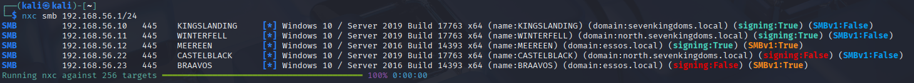
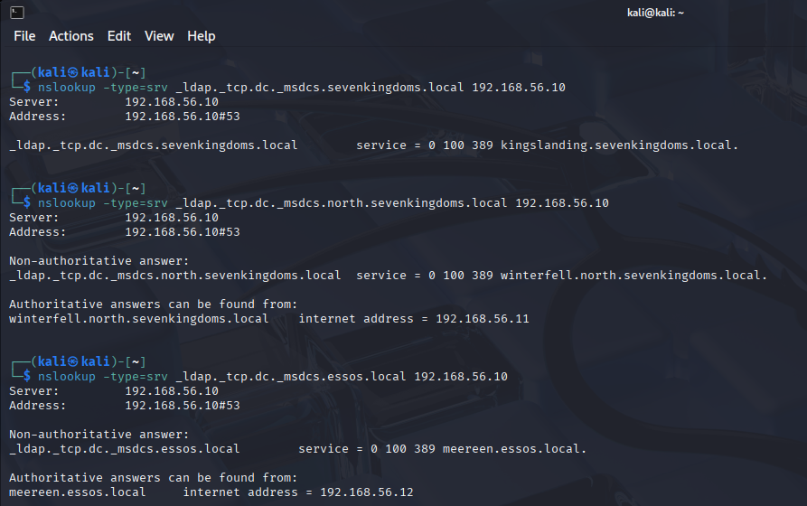

> [!NOTE]
> Original post can be found here:
> https://mayfly277.github.io/posts/GOADv2-pwning_part1/

# Enumerate Network

We will starting the reconnaissance of the Game Of Active Directory environment by searching all the available IPs.

## First recon with nxc

The first thing i personally do before launching an nmap is to scan for netbios results. For this i launch crackmapexec (cme) on the IP range to quickly get netbios answers by windows computers. This is a very kick way to get all the windows machine IP, names and domains.

>[!NOTE]
>Instead of cme I am going to use nxc. It is already install in Kali 2025.2. Github and docu can be found here:
> https://github.com/Pennyw0rth/NetExec
> https://www.netexec.wiki

```bash
nxc smb 192.168.56.1/24
```



This command answer relatively quickly and send back a lot of useful information!

We now know there is 3 domains:

- north.sevenkingdoms.local (2 ip)
    - CASTELBLACK (windows server 2019) (signing false)
    - WINTERFELL (windows server 2019)
- sevenkingdoms.local (1 ip)
    - KINGSLANDING (windows server 2019)
- essos.local (2 ip)
    - BRAAVOS (windows server 2016) (signing false)
    - MEEREEN (windows server 2019)

Here as we have 3 domains we know that three DCs must be setup. We also know that microsoft setup DC smb signing as true by default. So all the dc are the one with signing at true. (In a secure environment signing must true everywhere to avoid ntlm relay).

### Find DC ip

- Let’s enumerate the DCs by quering the dns with nslookup

```bash
nslookup -type=srv _ldap._tcp.dc._msdcs.sevenkingdoms.local 192.168.56.10
```



### setup /etc/hosts and kerberos

- To use kerberos in our Linux environment we will do some configurations.
- First we must set the DNS by configuring the /etc/hosts file

```bash
# /etc/hosts
# GOAD
192.168.56.10   sevenkingdoms.local kingslanding.sevenkingdoms.local kingslanding
192.168.56.11   winterfell.north.sevenkingdoms.local north.sevenkingdoms.local winterfell
192.168.56.12   essos.local meereen.essos.local meereen
192.168.56.22   castelblack.north.sevenkingdoms.local castelblack
192.168.56.23   braavos.essos.local braavos
```

- We must install the Linux kerberos client

```bash
sudo apt install krb5-user
```

- We answer the questions with :
    - realm : essos.local
    - servers : meereen.essos.local
- We will setup the /etc/krb5.conf file like this :
    
```
[libdefaults]
	default_realm = essos.local
	kdc_timesync = 1
	ccache_type = 4
	forwardable = true
	proxiable = true
	fcc-mit-ticketflags = true
[realms]
	north.sevenkingdoms.local = {
		kdc = winterfell.north.sevenkingdoms.local 
		admin_server = winterfell.north.sevenkingdoms.local
}
	sevenkingdoms.local = {      
		kdc = kingslanding.sevenkingdoms.local
		admin_server = kingslanding.sevenkingdoms.local  
}  
	essos.local = {      
		kdc = meereen.essos.local
		admin_server = meereen.essos.local  
		}
	...
```

    
- If krb5-user is already installed we can reconfigure it with (dpkg-reconfigure or by modifying /etc/krb5.conf)

```bash
dpkg-reconfigure krb5-config
```

- Now kerberos is set up on our environment we will try if we can get a TGT for a user.

```bash
impacket-getTGT essos.local/khal.drogo:horse
```


```bash
Impacket v0.13.0.dev0 - Copyright Fortra, LLC and its affiliated companies 

[*] Saving ticket in khal.drogo.ccache
```

```bash
export KRB5CCNAME=/home/kali/khal.drogo.ccache
```

```
nxc smb braavos.essos.local --use-kcache --shares
```

```
SMB         braavos.essos.local 445    BRAAVOS          [*] Windows 10 / Server 2016 Build 14393 x64 (name:BRAAVOS) (domain:essos.local) (signing:False) (SMBv1:True)                                                                                                                               
SMB         braavos.essos.local 445    BRAAVOS          [+] ESSOS.LOCAL\khal.drogo from ccache (Pwn3d!)
SMB         braavos.essos.local 445    BRAAVOS          [*] Enumerated shares
SMB         braavos.essos.local 445    BRAAVOS          Share           Permissions     Remark
SMB         braavos.essos.local 445    BRAAVOS          -----           -----------     ------
SMB         braavos.essos.local 445    BRAAVOS          ADMIN$          READ,WRITE      Remote Admin
SMB         braavos.essos.local 445    BRAAVOS          all             READ,WRITE      Basic RW share for all
SMB         braavos.essos.local 445    BRAAVOS          C$              READ,WRITE      Default share
SMB         braavos.essos.local 445    BRAAVOS          CertEnroll      READ,WRITE      Active Directory Certificate Services share
SMB         braavos.essos.local 445    BRAAVOS          IPC$            READ            Remote IPC
SMB         braavos.essos.local 445    BRAAVOS          public          READ,WRITE      Basic Read share for all domain users
```

- Ok the kerberos setup is good :)
- We could now unset the ticket:

```
unset KRB5CCNAME
```

- Trouble on winterfell
- During the kerberos tests we saw we get trouble on winterfell:

```bash
impacket-getTGT north.sevenkingdoms.local/arya.stark:Needle 
```


```
Impacket v0.13.0.dev0 - Copyright Fortra, LLC and its affiliated companies 

[*] Saving ticket in arya.stark.ccache
```

```
export KRB5CCNAME=/home/kali/arya.stark.ccache
```

```
nxc smb winterfell.north.sevenkingdoms.local --use-kcache --shares
```

```
SMB         winterfell.north.sevenkingdoms.local 445    WINTERFELL       [*] Windows 10 / Server 2019 Build 17763 x64 (name:WINTERFELL) (domain:north.sevenkingdoms.local) (signing:True) (SMBv1:False)
SMB         winterfell.north.sevenkingdoms.local 445    WINTERFELL       [+] NORTH.SEVENKINGDOMS.LOCAL\arya.stark from ccache 
SMB         winterfell.north.sevenkingdoms.local 445    WINTERFELL       [*] Enumerated shares
SMB         winterfell.north.sevenkingdoms.local 445    WINTERFELL       Share           Permissions     Remark
SMB         winterfell.north.sevenkingdoms.local 445    WINTERFELL       -----           -----------     ------
SMB         winterfell.north.sevenkingdoms.local 445    WINTERFELL       ADMIN$                          Remote Admin
SMB         winterfell.north.sevenkingdoms.local 445    WINTERFELL       C$                              Default share
SMB         winterfell.north.sevenkingdoms.local 445    WINTERFELL       IPC$            READ            Remote IPC
SMB         winterfell.north.sevenkingdoms.local 445    WINTERFELL       NETLOGON        READ            Logon server share 
SMB         winterfell.north.sevenkingdoms.local 445    WINTERFELL       SYSVOL          READ            Logon server share
```

```
nxc smb winterfell --use-kcache --shares
```

```
SMB         winterfell      445    WINTERFELL       [*] Windows 10 / Server 2019 Build 17763 x64 (name:WINTERFELL) (domain:north.sevenkingdoms.local) (signing:True) (SMBv1:False)
SMB         winterfell      445    WINTERFELL       [+] NORTH.SEVENKINGDOMS.LOCAL\arya.stark from ccache 
SMB         winterfell      445    WINTERFELL       [*] Enumerated shares
SMB         winterfell      445    WINTERFELL       Share           Permissions     Remark
SMB         winterfell      445    WINTERFELL       -----           -----------     ------
SMB         winterfell      445    WINTERFELL       ADMIN$                          Remote Admin
SMB         winterfell      445    WINTERFELL       C$                              Default share
SMB         winterfell      445    WINTERFELL       IPC$            READ            Remote IPC
SMB         winterfell      445    WINTERFELL       NETLOGON        READ            Logon server share 
SMB         winterfell      445    WINTERFELL       SYSVOL          READ            Logon server share
```


### Nmap

One thing to know is that nmap will do a ping before scanning the target. If the target doesn’t answer to ping it will be ignore.

The way to be sure we doesn’t miss anything on TCP, could be to scan with the following options:

```
nmap -Pn -p- -sC -sV -oA full_scan_goad 192.168.56.10-12,22-23
```


Let’s analyze this command :

- `-Pn` don’t do ping scan and scan all ip
- `-p-` scan the 65535 ports instead of the default nmap 1000 top ports by default
- `-sC` play the default script for reconnaissance
- `-sV` enumerate the version
- `-oA` write results in the 3 available format (nmap classic, grep format, xml format)
    
- The full scan result is:

```
nmap -Pn -p- -sC -sV -oA full_scan_goad 192.168.56.10-12,22-23 
Starting Nmap 7.95 ( https://nmap.org ) at 2025-07-22 21:38 CEST
Nmap scan report for sevenkingdoms.local (192.168.56.10)
Host is up (0.00049s latency).
Not shown: 65506 closed tcp ports (reset)
PORT      STATE SERVICE       VERSION
53/tcp    open  domain        Simple DNS Plus
80/tcp    open  http          Microsoft IIS httpd 10.0
| http-methods: 
|_  Potentially risky methods: TRACE
|_http-title: IIS Windows Server
|_http-server-header: Microsoft-IIS/10.0
88/tcp    open  kerberos-sec  Microsoft Windows Kerberos (server time: 2025-07-22 19:39:31Z)
135/tcp   open  msrpc         Microsoft Windows RPC
139/tcp   open  netbios-ssn   Microsoft Windows netbios-ssn
389/tcp   open  ldap          Microsoft Windows Active Directory LDAP (Domain: sevenkingdoms.local0., Site: Default-First-Site-Name)
|_ssl-date: 2025-07-22T19:42:22+00:00; +2s from scanner time.
| ssl-cert: Subject: commonName=kingslanding.sevenkingdoms.local
| Subject Alternative Name: othername: 1.3.6.1.4.1.311.25.1:<unsupported>, DNS:kingslanding.sevenkingdoms.local
| Not valid before: 2025-06-08T21:09:53
|_Not valid after:  2026-06-08T21:09:53
445/tcp   open  microsoft-ds?
464/tcp   open  kpasswd5?
593/tcp   open  ncacn_http    Microsoft Windows RPC over HTTP 1.0
636/tcp   open  ssl/ldap      Microsoft Windows Active Directory LDAP (Domain: sevenkingdoms.local0., Site: Default-First-Site-Name)
| ssl-cert: Subject: commonName=kingslanding.sevenkingdoms.local
| Subject Alternative Name: othername: 1.3.6.1.4.1.311.25.1:<unsupported>, DNS:kingslanding.sevenkingdoms.local
| Not valid before: 2025-06-08T21:09:53
|_Not valid after:  2026-06-08T21:09:53
|_ssl-date: 2025-07-22T19:42:22+00:00; +2s from scanner time.
3268/tcp  open  ldap          Microsoft Windows Active Directory LDAP (Domain: sevenkingdoms.local0., Site: Default-First-Site-Name)
|_ssl-date: 2025-07-22T19:42:22+00:00; +2s from scanner time.
| ssl-cert: Subject: commonName=kingslanding.sevenkingdoms.local
| Subject Alternative Name: othername: 1.3.6.1.4.1.311.25.1:<unsupported>, DNS:kingslanding.sevenkingdoms.local
| Not valid before: 2025-06-08T21:09:53
|_Not valid after:  2026-06-08T21:09:53
3269/tcp  open  ssl/ldap
|_ssl-date: 2025-07-22T19:42:22+00:00; +2s from scanner time.
| ssl-cert: Subject: commonName=kingslanding.sevenkingdoms.local
| Subject Alternative Name: othername: 1.3.6.1.4.1.311.25.1:<unsupported>, DNS:kingslanding.sevenkingdoms.local
| Not valid before: 2025-06-08T21:09:53
|_Not valid after:  2026-06-08T21:09:53
3389/tcp  open  ms-wbt-server Microsoft Terminal Services
|_ssl-date: 2025-07-22T19:42:22+00:00; +2s from scanner time.
| ssl-cert: Subject: commonName=kingslanding.sevenkingdoms.local
| Not valid before: 2025-06-07T20:48:28
|_Not valid after:  2025-12-07T20:48:28
5985/tcp  open  http          Microsoft HTTPAPI httpd 2.0 (SSDP/UPnP)
|_http-server-header: Microsoft-HTTPAPI/2.0
|_http-title: Not Found
5986/tcp  open  ssl/http      Microsoft HTTPAPI httpd 2.0 (SSDP/UPnP)
|_ssl-date: 2025-07-22T19:42:22+00:00; +2s from scanner time.
|_http-server-header: Microsoft-HTTPAPI/2.0
| ssl-cert: Subject: commonName=VAGRANT
| Subject Alternative Name: DNS:VAGRANT, DNS:vagrant
| Not valid before: 2025-06-07T13:30:13
|_Not valid after:  2028-06-06T13:30:13
|_http-title: Not Found
| tls-alpn: 
|_  http/1.1
9389/tcp  open  mc-nmf        .NET Message Framing
47001/tcp open  http          Microsoft HTTPAPI httpd 2.0 (SSDP/UPnP)
|_http-title: Not Found
|_http-server-header: Microsoft-HTTPAPI/2.0
49664/tcp open  msrpc         Microsoft Windows RPC
49665/tcp open  msrpc         Microsoft Windows RPC
49666/tcp open  msrpc         Microsoft Windows RPC
49667/tcp open  msrpc         Microsoft Windows RPC
49669/tcp open  msrpc         Microsoft Windows RPC
49670/tcp open  msrpc         Microsoft Windows RPC
49671/tcp open  ncacn_http    Microsoft Windows RPC over HTTP 1.0
49673/tcp open  msrpc         Microsoft Windows RPC
49676/tcp open  msrpc         Microsoft Windows RPC
49686/tcp open  msrpc         Microsoft Windows RPC
49699/tcp open  msrpc         Microsoft Windows RPC
63965/tcp open  msrpc         Microsoft Windows RPC
MAC Address: 08:00:27:6C:BD:EB (PCS Systemtechnik/Oracle VirtualBox virtual NIC)
Service Info: Host: KINGSLANDING; OS: Windows; CPE: cpe:/o:microsoft:windows

Host script results:
| smb2-time: 
|   date: 2025-07-22T19:42:07
|_  start_date: N/A
|_nbstat: NetBIOS name: KINGSLANDING, NetBIOS user: <unknown>, NetBIOS MAC: 08:00:27:6c:bd:eb (PCS Systemtechnik/Oracle VirtualBox virtual NIC)
| smb2-security-mode: 
|   3:1:1: 
|_    Message signing enabled and required
|_clock-skew: mean: 1s, deviation: 0s, median: 1s

Nmap scan report for winterfell.north.sevenkingdoms.local (192.168.56.11)
Host is up (0.00017s latency).
Not shown: 65508 closed tcp ports (reset)
PORT      STATE SERVICE       VERSION
53/tcp    open  domain        Simple DNS Plus
88/tcp    open  kerberos-sec  Microsoft Windows Kerberos (server time: 2025-07-22 19:39:37Z)
135/tcp   open  msrpc         Microsoft Windows RPC
139/tcp   open  netbios-ssn   Microsoft Windows netbios-ssn
389/tcp   open  ldap          Microsoft Windows Active Directory LDAP (Domain: sevenkingdoms.local0., Site: Default-First-Site-Name)
445/tcp   open  microsoft-ds?
464/tcp   open  kpasswd5?
593/tcp   open  ncacn_http    Microsoft Windows RPC over HTTP 1.0
636/tcp   open  tcpwrapped
3268/tcp  open  ldap          Microsoft Windows Active Directory LDAP (Domain: sevenkingdoms.local0., Site: Default-First-Site-Name)
3269/tcp  open  tcpwrapped
3389/tcp  open  ms-wbt-server Microsoft Terminal Services
|_ssl-date: 2025-07-22T19:42:22+00:00; +2s from scanner time.
| ssl-cert: Subject: commonName=winterfell.north.sevenkingdoms.local
| Not valid before: 2025-06-07T20:57:06
|_Not valid after:  2025-12-07T20:57:06
5985/tcp  open  http          Microsoft HTTPAPI httpd 2.0 (SSDP/UPnP)
|_http-server-header: Microsoft-HTTPAPI/2.0
|_http-title: Not Found
5986/tcp  open  ssl/http      Microsoft HTTPAPI httpd 2.0 (SSDP/UPnP)
|_ssl-date: 2025-07-22T19:42:22+00:00; +2s from scanner time.
|_http-server-header: Microsoft-HTTPAPI/2.0
|_http-title: Not Found
| ssl-cert: Subject: commonName=VAGRANT
| Subject Alternative Name: DNS:VAGRANT, DNS:vagrant
| Not valid before: 2025-06-07T13:32:31
|_Not valid after:  2028-06-06T13:32:31
| tls-alpn: 
|_  http/1.1
9389/tcp  open  mc-nmf        .NET Message Framing
47001/tcp open  http          Microsoft HTTPAPI httpd 2.0 (SSDP/UPnP)
|_http-server-header: Microsoft-HTTPAPI/2.0
|_http-title: Not Found
49664/tcp open  msrpc         Microsoft Windows RPC
49665/tcp open  msrpc         Microsoft Windows RPC
49666/tcp open  msrpc         Microsoft Windows RPC
49667/tcp open  msrpc         Microsoft Windows RPC
49669/tcp open  msrpc         Microsoft Windows RPC
49674/tcp open  msrpc         Microsoft Windows RPC
49675/tcp open  ncacn_http    Microsoft Windows RPC over HTTP 1.0
49678/tcp open  msrpc         Microsoft Windows RPC
49682/tcp open  msrpc         Microsoft Windows RPC
49718/tcp open  msrpc         Microsoft Windows RPC
50664/tcp open  msrpc         Microsoft Windows RPC
MAC Address: 08:00:27:B7:87:0A (PCS Systemtechnik/Oracle VirtualBox virtual NIC)
Service Info: Host: WINTERFELL; OS: Windows; CPE: cpe:/o:microsoft:windows

Host script results:
| smb2-time: 
|   date: 2025-07-22T19:42:14
|_  start_date: N/A
| smb2-security-mode: 
|   3:1:1: 
|_    Message signing enabled and required
|_nbstat: NetBIOS name: WINTERFELL, NetBIOS user: <unknown>, NetBIOS MAC: 08:00:27:b7:87:0a (PCS Systemtechnik/Oracle VirtualBox virtual NIC)
|_clock-skew: mean: 1s, deviation: 0s, median: 1s

Nmap scan report for essos.local (192.168.56.12)
Host is up (0.00021s latency).
Not shown: 65508 closed tcp ports (reset)
PORT      STATE SERVICE       VERSION
53/tcp    open  domain        Simple DNS Plus
88/tcp    open  kerberos-sec  Microsoft Windows Kerberos (server time: 2025-07-22 19:40:25Z)
135/tcp   open  msrpc         Microsoft Windows RPC
139/tcp   open  netbios-ssn   Microsoft Windows netbios-ssn
389/tcp   open  ldap          Microsoft Windows Active Directory LDAP (Domain: essos.local, Site: Default-First-Site-Name)
| ssl-cert: Subject: commonName=meereen.essos.local
| Subject Alternative Name: othername: 1.3.6.1.4.1.311.25.1:<unsupported>, DNS:meereen.essos.local
| Not valid before: 2025-06-08T21:10:06
|_Not valid after:  2026-06-08T21:10:06
|_ssl-date: 2025-07-22T19:42:22+00:00; +2s from scanner time.
445/tcp   open  microsoft-ds  Windows Server 2016 Standard Evaluation 14393 microsoft-ds (workgroup: ESSOS)
464/tcp   open  kpasswd5?
593/tcp   open  ncacn_http    Microsoft Windows RPC over HTTP 1.0
636/tcp   open  ssl/ldap      Microsoft Windows Active Directory LDAP (Domain: essos.local, Site: Default-First-Site-Name)
| ssl-cert: Subject: commonName=meereen.essos.local
| Subject Alternative Name: othername: 1.3.6.1.4.1.311.25.1:<unsupported>, DNS:meereen.essos.local
| Not valid before: 2025-06-08T21:10:06
|_Not valid after:  2026-06-08T21:10:06
|_ssl-date: 2025-07-22T19:42:22+00:00; +2s from scanner time.
3268/tcp  open  ldap          Microsoft Windows Active Directory LDAP (Domain: essos.local, Site: Default-First-Site-Name)
| ssl-cert: Subject: commonName=meereen.essos.local
| Subject Alternative Name: othername: 1.3.6.1.4.1.311.25.1:<unsupported>, DNS:meereen.essos.local
| Not valid before: 2025-06-08T21:10:06
|_Not valid after:  2026-06-08T21:10:06
|_ssl-date: 2025-07-22T19:42:22+00:00; +2s from scanner time.
3269/tcp  open  ssl/ldap      Microsoft Windows Active Directory LDAP (Domain: essos.local, Site: Default-First-Site-Name)
| ssl-cert: Subject: commonName=meereen.essos.local
| Subject Alternative Name: othername: 1.3.6.1.4.1.311.25.1:<unsupported>, DNS:meereen.essos.local
| Not valid before: 2025-06-08T21:10:06
|_Not valid after:  2026-06-08T21:10:06
|_ssl-date: 2025-07-22T19:42:22+00:00; +2s from scanner time.
3389/tcp  open  ms-wbt-server Microsoft Terminal Services
|_ssl-date: 2025-07-22T19:42:22+00:00; +2s from scanner time.
| rdp-ntlm-info: 
|   Target_Name: ESSOS
|   NetBIOS_Domain_Name: ESSOS
|   NetBIOS_Computer_Name: MEEREEN
|   DNS_Domain_Name: essos.local
|   DNS_Computer_Name: meereen.essos.local
|   DNS_Tree_Name: essos.local
|   Product_Version: 10.0.14393
|_  System_Time: 2025-07-22T19:42:12+00:00
| ssl-cert: Subject: commonName=meereen.essos.local
| Not valid before: 2025-06-07T20:48:28
|_Not valid after:  2025-12-07T20:48:28
5985/tcp  open  http          Microsoft HTTPAPI httpd 2.0 (SSDP/UPnP)
|_http-server-header: Microsoft-HTTPAPI/2.0
|_http-title: Not Found
5986/tcp  open  ssl/http      Microsoft HTTPAPI httpd 2.0 (SSDP/UPnP)
|_http-title: Not Found
|_http-server-header: Microsoft-HTTPAPI/2.0
|_ssl-date: 2025-07-22T19:42:22+00:00; +2s from scanner time.
| tls-alpn: 
|   h2
|_  http/1.1
| ssl-cert: Subject: commonName=VAGRANT
| Subject Alternative Name: DNS:VAGRANT, DNS:vagrant
| Not valid before: 2025-06-07T13:34:24
|_Not valid after:  2028-06-06T13:34:24
9389/tcp  open  mc-nmf        .NET Message Framing
47001/tcp open  http          Microsoft HTTPAPI httpd 2.0 (SSDP/UPnP)
|_http-title: Not Found
|_http-server-header: Microsoft-HTTPAPI/2.0
49664/tcp open  msrpc         Microsoft Windows RPC
49665/tcp open  msrpc         Microsoft Windows RPC
49666/tcp open  msrpc         Microsoft Windows RPC
49668/tcp open  msrpc         Microsoft Windows RPC
49671/tcp open  msrpc         Microsoft Windows RPC
49678/tcp open  msrpc         Microsoft Windows RPC
49679/tcp open  ncacn_http    Microsoft Windows RPC over HTTP 1.0
49681/tcp open  msrpc         Microsoft Windows RPC
49684/tcp open  msrpc         Microsoft Windows RPC
49694/tcp open  msrpc         Microsoft Windows RPC
60715/tcp open  msrpc         Microsoft Windows RPC
MAC Address: 08:00:27:C2:67:CE (PCS Systemtechnik/Oracle VirtualBox virtual NIC)
Service Info: Host: MEEREEN; OS: Windows; CPE: cpe:/o:microsoft:windows

Host script results:
| smb2-time: 
|   date: 2025-07-22T19:42:14
|_  start_date: 2025-07-22T19:33:19
| smb-os-discovery: 
|   OS: Windows Server 2016 Standard Evaluation 14393 (Windows Server 2016 Standard Evaluation 6.3)
|   Computer name: meereen
|   NetBIOS computer name: MEEREEN\x00
|   Domain name: essos.local
|   Forest name: essos.local
|   FQDN: meereen.essos.local
|_  System time: 2025-07-22T12:42:14-07:00
| smb-security-mode: 
|   account_used: guest
|   authentication_level: user
|   challenge_response: supported
|_  message_signing: required
|_clock-skew: mean: 42m02s, deviation: 2h12m50s, median: 1s
| smb2-security-mode: 
|   3:1:1: 
|_    Message signing enabled and required
|_nbstat: NetBIOS name: MEEREEN, NetBIOS user: <unknown>, NetBIOS MAC: 08:00:27:c2:67:ce (PCS Systemtechnik/Oracle VirtualBox virtual NIC)

Nmap scan report for castelblack.north.sevenkingdoms.local (192.168.56.22)
Host is up (0.00041s latency).
Not shown: 65516 closed tcp ports (reset)
PORT      STATE SERVICE       VERSION
80/tcp    open  http          Microsoft IIS httpd 10.0
| http-methods: 
|_  Potentially risky methods: TRACE
|_http-title: Site doesn't have a title (text/html).
|_http-server-header: Microsoft-IIS/10.0
135/tcp   open  msrpc         Microsoft Windows RPC
139/tcp   open  netbios-ssn   Microsoft Windows netbios-ssn
445/tcp   open  microsoft-ds?
1433/tcp  open  ms-sql-s      Microsoft SQL Server 2019 15.00.2000.00; RTM
|_ssl-date: 2025-07-22T19:42:22+00:00; +2s from scanner time.
| ms-sql-ntlm-info: 
|   192.168.56.22:1433: 
|     Target_Name: NORTH
|     NetBIOS_Domain_Name: NORTH
|     NetBIOS_Computer_Name: CASTELBLACK
|     DNS_Domain_Name: north.sevenkingdoms.local
|     DNS_Computer_Name: castelblack.north.sevenkingdoms.local
|     DNS_Tree_Name: sevenkingdoms.local
|_    Product_Version: 10.0.17763
| ms-sql-info: 
|   192.168.56.22:1433: 
|     Version: 
|       name: Microsoft SQL Server 2019 RTM
|       number: 15.00.2000.00
|       Product: Microsoft SQL Server 2019
|       Service pack level: RTM
|       Post-SP patches applied: false
|_    TCP port: 1433
| ssl-cert: Subject: commonName=SSL_Self_Signed_Fallback
| Not valid before: 2025-07-22T19:34:10
|_Not valid after:  2055-07-22T19:34:10
3389/tcp  open  ms-wbt-server Microsoft Terminal Services
| ssl-cert: Subject: commonName=castelblack.north.sevenkingdoms.local
| Not valid before: 2025-06-07T21:09:37
|_Not valid after:  2025-12-07T21:09:37
| rdp-ntlm-info: 
|   Target_Name: NORTH
|   NetBIOS_Domain_Name: NORTH
|   NetBIOS_Computer_Name: CASTELBLACK
|   DNS_Domain_Name: north.sevenkingdoms.local
|   DNS_Computer_Name: castelblack.north.sevenkingdoms.local
|   DNS_Tree_Name: sevenkingdoms.local
|   Product_Version: 10.0.17763
|_  System_Time: 2025-07-22T19:42:08+00:00
|_ssl-date: 2025-07-22T19:42:22+00:00; +2s from scanner time.
5985/tcp  open  http          Microsoft HTTPAPI httpd 2.0 (SSDP/UPnP)
|_http-server-header: Microsoft-HTTPAPI/2.0
|_http-title: Not Found
5986/tcp  open  ssl/http      Microsoft HTTPAPI httpd 2.0 (SSDP/UPnP)
|_http-server-header: Microsoft-HTTPAPI/2.0
| ssl-cert: Subject: commonName=VAGRANT
| Subject Alternative Name: DNS:VAGRANT, DNS:vagrant
| Not valid before: 2025-06-07T13:37:00
|_Not valid after:  2028-06-06T13:37:00
|_http-title: Not Found
| tls-alpn: 
|_  http/1.1
|_ssl-date: 2025-07-22T19:42:22+00:00; +2s from scanner time.
47001/tcp open  http          Microsoft HTTPAPI httpd 2.0 (SSDP/UPnP)
|_http-title: Not Found
|_http-server-header: Microsoft-HTTPAPI/2.0
49664/tcp open  msrpc         Microsoft Windows RPC
49665/tcp open  msrpc         Microsoft Windows RPC
49666/tcp open  msrpc         Microsoft Windows RPC
49667/tcp open  msrpc         Microsoft Windows RPC
49668/tcp open  msrpc         Microsoft Windows RPC
49669/tcp open  msrpc         Microsoft Windows RPC
49671/tcp open  msrpc         Microsoft Windows RPC
49672/tcp open  msrpc         Microsoft Windows RPC
52259/tcp open  msrpc         Microsoft Windows RPC
65298/tcp open  ms-sql-s      Microsoft SQL Server 2019 15.00.2000.00; RTM
|_ssl-date: 2025-07-22T19:42:22+00:00; +2s from scanner time.
| ms-sql-info: 
|   192.168.56.22:65298: 
|     Version: 
|       name: Microsoft SQL Server 2019 RTM
|       number: 15.00.2000.00
|       Product: Microsoft SQL Server 2019
|       Service pack level: RTM
|       Post-SP patches applied: false
|_    TCP port: 65298
| ssl-cert: Subject: commonName=SSL_Self_Signed_Fallback
| Not valid before: 2025-07-22T19:34:10
|_Not valid after:  2055-07-22T19:34:10
| ms-sql-ntlm-info: 
|   192.168.56.22:65298: 
|     Target_Name: NORTH
|     NetBIOS_Domain_Name: NORTH
|     NetBIOS_Computer_Name: CASTELBLACK
|     DNS_Domain_Name: north.sevenkingdoms.local
|     DNS_Computer_Name: castelblack.north.sevenkingdoms.local
|     DNS_Tree_Name: sevenkingdoms.local
|_    Product_Version: 10.0.17763
MAC Address: 08:00:27:24:6F:0A (PCS Systemtechnik/Oracle VirtualBox virtual NIC)
Service Info: OS: Windows; CPE: cpe:/o:microsoft:windows

Host script results:
| smb2-time: 
|   date: 2025-07-22T19:42:15
|_  start_date: N/A
|_clock-skew: mean: 1s, deviation: 0s, median: 1s
| smb2-security-mode: 
|   3:1:1: 
|_    Message signing enabled but not required
|_nbstat: NetBIOS name: CASTELBLACK, NetBIOS user: <unknown>, NetBIOS MAC: 08:00:27:24:6f:0a (PCS Systemtechnik/Oracle VirtualBox virtual NIC)

Nmap scan report for braavos.essos.local (192.168.56.23)
Host is up (0.00084s latency).
Not shown: 65516 closed tcp ports (reset)
PORT      STATE SERVICE       VERSION
80/tcp    open  http          Microsoft IIS httpd 10.0
|_http-title: IIS Windows Server
| http-methods: 
|_  Potentially risky methods: TRACE
|_http-server-header: Microsoft-IIS/10.0
135/tcp   open  msrpc         Microsoft Windows RPC
139/tcp   open  netbios-ssn   Microsoft Windows netbios-ssn
445/tcp   open  microsoft-ds  Windows Server 2016 Standard Evaluation 14393 microsoft-ds
1433/tcp  open  ms-sql-s      Microsoft SQL Server 2019 15.00.2000.00; RTM
|_ssl-date: 2025-07-22T19:57:14+00:00; +1s from scanner time.
| ssl-cert: Subject: commonName=SSL_Self_Signed_Fallback
| Not valid before: 2025-07-22T19:34:32
|_Not valid after:  2055-07-22T19:34:32
| ms-sql-info: 
|   192.168.56.23:1433: 
|     Version: 
|       name: Microsoft SQL Server 2019 RTM
|       number: 15.00.2000.00
|       Product: Microsoft SQL Server 2019
|       Service pack level: RTM
|       Post-SP patches applied: false
|_    TCP port: 1433
| ms-sql-ntlm-info: 
|   192.168.56.23:1433: 
|     Target_Name: ESSOS
|     NetBIOS_Domain_Name: ESSOS
|     NetBIOS_Computer_Name: BRAAVOS
|     DNS_Domain_Name: essos.local
|     DNS_Computer_Name: braavos.essos.local
|     DNS_Tree_Name: essos.local
|_    Product_Version: 10.0.14393
3389/tcp  open  ms-wbt-server Microsoft Terminal Services
|_ssl-date: 2025-07-22T19:57:14+00:00; +1s from scanner time.
| ssl-cert: Subject: commonName=braavos.essos.local
| Not valid before: 2025-06-07T21:09:36
|_Not valid after:  2025-12-07T21:09:36
5985/tcp  open  http          Microsoft HTTPAPI httpd 2.0 (SSDP/UPnP)
|_http-title: Not Found
|_http-server-header: Microsoft-HTTPAPI/2.0
5986/tcp  open  ssl/http      Microsoft HTTPAPI httpd 2.0 (SSDP/UPnP)
|_http-server-header: Microsoft-HTTPAPI/2.0
|_ssl-date: 2025-07-22T19:57:14+00:00; +1s from scanner time.
| ssl-cert: Subject: commonName=VAGRANT
| Subject Alternative Name: DNS:VAGRANT, DNS:vagrant
| Not valid before: 2025-06-07T13:39:24
|_Not valid after:  2028-06-06T13:39:24
|_http-title: Not Found
| tls-alpn: 
|   h2
|_  http/1.1
47001/tcp open  http          Microsoft HTTPAPI httpd 2.0 (SSDP/UPnP)
|_http-server-header: Microsoft-HTTPAPI/2.0
|_http-title: Not Found
49664/tcp open  msrpc         Microsoft Windows RPC
49665/tcp open  msrpc         Microsoft Windows RPC
49666/tcp open  msrpc         Microsoft Windows RPC
49667/tcp open  msrpc         Microsoft Windows RPC
49668/tcp open  msrpc         Microsoft Windows RPC
49671/tcp open  msrpc         Microsoft Windows RPC
49673/tcp open  msrpc         Microsoft Windows RPC
49707/tcp open  msrpc         Microsoft Windows RPC
57445/tcp open  ms-sql-s      Microsoft SQL Server 2019 15.00.2000.00; RTM
| ms-sql-info: 
|   192.168.56.23:57445: 
|     Version: 
|       name: Microsoft SQL Server 2019 RTM
|       number: 15.00.2000.00
|       Product: Microsoft SQL Server 2019
|       Service pack level: RTM
|       Post-SP patches applied: false
|_    TCP port: 57445
| ssl-cert: Subject: commonName=SSL_Self_Signed_Fallback
| Not valid before: 2025-07-22T19:34:32
|_Not valid after:  2055-07-22T19:34:32
| ms-sql-ntlm-info: 
|   192.168.56.23:57445: 
|     Target_Name: ESSOS
|     NetBIOS_Domain_Name: ESSOS
|     NetBIOS_Computer_Name: BRAAVOS
|     DNS_Domain_Name: essos.local
|     DNS_Computer_Name: braavos.essos.local
|     DNS_Tree_Name: essos.local
|_    Product_Version: 10.0.14393
|_ssl-date: 2025-07-22T19:57:14+00:00; +1s from scanner time.
60931/tcp open  msrpc         Microsoft Windows RPC
MAC Address: 08:00:27:B7:45:6B (PCS Systemtechnik/Oracle VirtualBox virtual NIC)
Service Info: OSs: Windows, Windows Server 2008 R2 - 2012; CPE: cpe:/o:microsoft:windows

Host script results:
|_nbstat: NetBIOS name: BRAAVOS, NetBIOS user: <unknown>, NetBIOS MAC: 08:00:27:b7:45:6b (PCS Systemtechnik/Oracle VirtualBox virtual NIC)
| smb-os-discovery: 
|   OS: Windows Server 2016 Standard Evaluation 14393 (Windows Server 2016 Standard Evaluation 6.3)
|   Computer name: braavos
|   NetBIOS computer name: BRAAVOS\x00
|   Domain name: essos.local
|   Forest name: essos.local
|   FQDN: braavos.essos.local
|_  System time: 2025-07-22T12:57:09-07:00
| smb2-security-mode: 
|   3:1:1: 
|_    Message signing enabled but not required
| smb2-time: 
|   date: 2025-07-22T19:57:09
|_  start_date: 2025-07-22T19:34:28
| smb-security-mode: 
|   account_used: guest
|   authentication_level: user
|   challenge_response: supported
|_  message_signing: disabled (dangerous, but default)
|_clock-skew: mean: 46m40s, deviation: 2h20m00s, median: 0s

Post-scan script results:
| clock-skew: 
|   1s: 
|     192.168.56.11 (winterfell.north.sevenkingdoms.local)
|     192.168.56.12 (essos.local)
|     192.168.56.10 (sevenkingdoms.local)
|_    192.168.56.22 (castelblack.north.sevenkingdoms.local)
Service detection performed. Please report any incorrect results at https://nmap.org/submit/ .
Nmap done: 5 IP addresses (5 hosts up) scanned in 1101.29 seconds
```

- Ok we now know all the hosts and service exposed, let try an anonymous enumeration in the second part.

>[!NOTE] 
> I have to dig deeper into this

```bash
smbclient.py -k @braavos.essos.local ???
```

```
smbclient.py -k -no-pass @winterfell.north.sevenkingdoms.local
```

- Actually i don’t know why kerberos doesn’t work on winterfell with the full FQDN, but it’s ok by just setting winterfell instead of winterfell.north.sevenkingdoms.local

```bash
smbclient.py -k -no-pass @winterfell
```

```
impacket-smbclient -k -no-pass -dc-ip 192.168.56.12 'essos.local/khal.drogo'@essos.local
```

# interesting links

https://notes.benheater.com/books/active-directory/page/kerberos-authentication-from-kali
